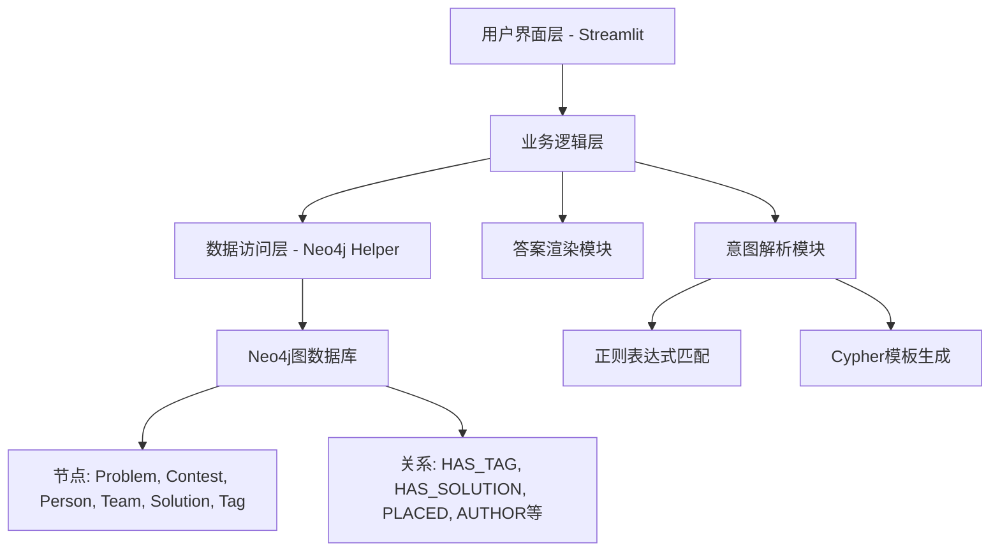
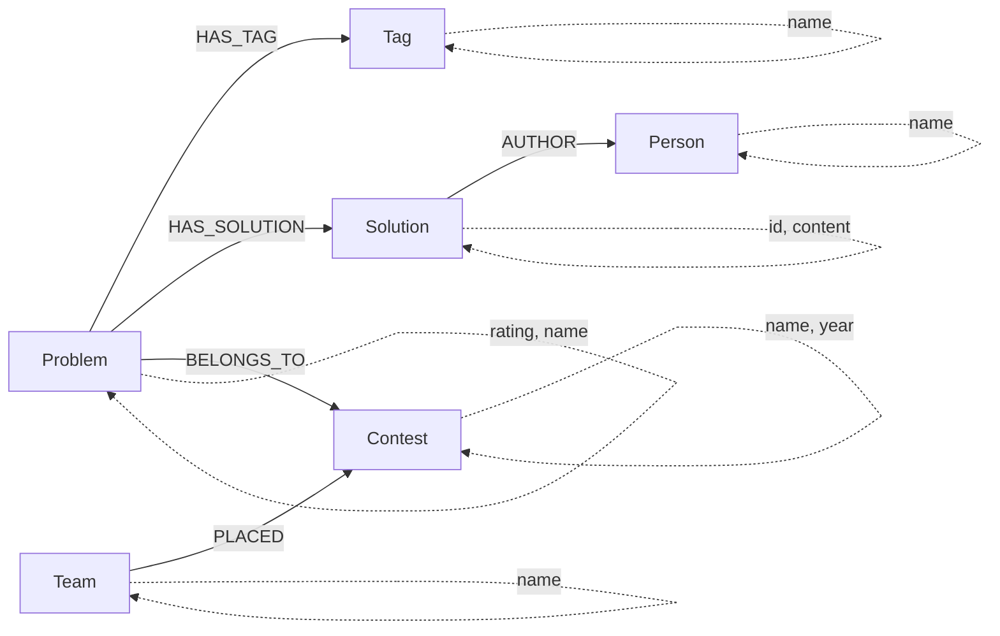
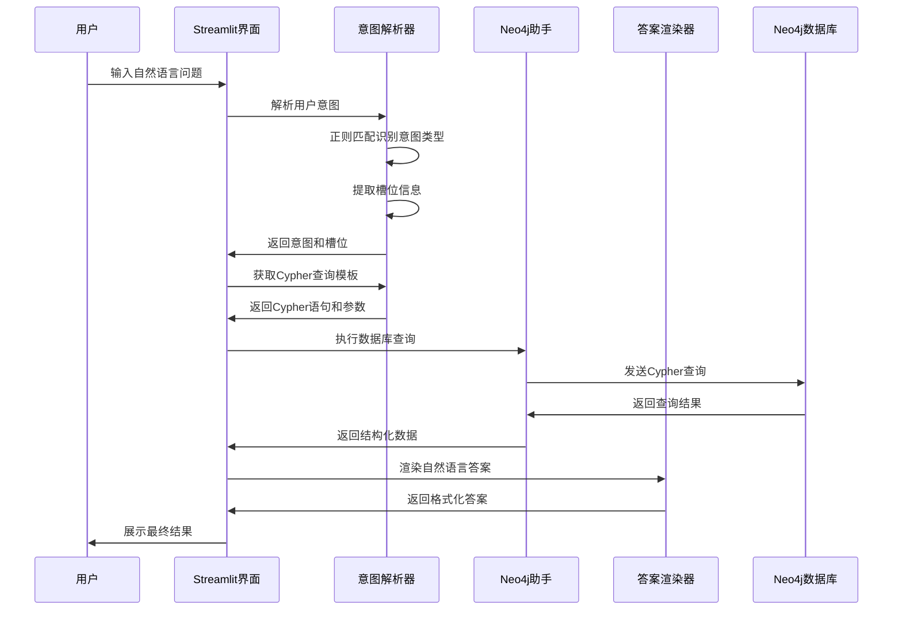

# ACM-ICPC知识图谱问答系统 项目分析

## 概述

### 项目简介
ACM-ICPC知识图谱问答系统是一个基于Neo4j图数据库的智能问答应用，专门针对ACM/ICPC竞赛编程领域的知识管理和查询。系统通过自然语言处理技术，将用户的中文问题转换为Cypher查询语句，并从知识图谱中检索相关信息，最终以自然语言形式呈现答案。

### 核心价值
- **知识整合**: 统一管理ACM/ICPC相关的题目、算法、竞赛、选手、题解等多维度信息
- **智能查询**: 支持自然语言输入，降低用户使用门槛
- **结构化存储**: 利用图数据库优势，表达复杂的实体关系
- **教学辅助**: 为竞赛编程学习提供便捷的知识检索工具

### 技术栈
- **前端界面**: Streamlit - 快速构建交互式Web应用
- **图数据库**: Neo4j - 存储和查询知识图谱
- **自然语言处理**: 基于正则表达式的意图识别和槽位提取
- **后端语言**: Python

## 架构设计

### 整体架构
系统采用分层架构设计，将数据存储、业务逻辑和用户界面清晰分离：

### 核心组件

#### 用户界面层 (app.py)
负责用户交互和界面展示，提供：
- 问题输入接口
- 查询结果展示
- 调试信息显示（意图解析、Cypher语句等）

#### 意图解析模块 (nl_to_cypher.py)
实现自然语言到结构化查询的转换：
- 基于正则表达式的意图识别
- 槽位信息提取
- Cypher查询模板映射

#### 数据访问层 (neo4j_helper.py)
封装Neo4j数据库操作：
- 数据库连接管理
- Cypher查询执行
- 结果集转换

#### 答案渲染模块 (answer_renderer.py)
根据不同意图类型格式化查询结果：
- 结构化数据到自然语言转换
- 个性化答案模板
- 友好的用户展示格式

## 数据模型设计

### 核心实体
基于CSV导入文件分析，知识图谱包含以下核心实体：

| 实体类型 | 描述     | 主要属性                             |
| -------- | -------- | ------------------------------------ |
| Problem  | 编程题目 | name（题目名称）, rating（难度等级） |
| Contest  | 竞赛信息 | name（竞赛名称）, year（年份）       |
| Person   | 个人选手 | name（姓名）                         |
| Team     | 团队     | name（团队名称）                     |
| Solution | 题解     | id（题解ID）, content（内容）        |
| Tag      | 算法标签 | name（标签名称）                     |

### 关系模型
实体间通过以下关系建立连接：

| 关系类型     | 起始实体 | 目标实体 | 描述             | 属性                         |
| ------------ | -------- | -------- | ---------------- | ---------------------------- |
| HAS_TAG      | Problem  | Tag      | 题目包含算法标签 | -                            |
| HAS_SOLUTION | Problem  | Solution | 题目拥有题解     | -                            |
| AUTHOR       | Solution | Person   | 题解作者关系     | -                            |
| PLACED       | Team     | Contest  | 团队参赛名次     | rank（排名）, region（地区） |

### 知识图谱结构

## 业务功能设计

### 支持的查询意图

#### 题目难度查询 (get_problem_difficulty)
- **触发模式**: "题目XXX的难度"
- **业务逻辑**: 根据题目名称模糊匹配，返回难度等级
- **Cypher查询**: 匹配Problem节点，返回name和rating属性

#### 标签题目列表 (list_problems_by_tag)
- **触发模式**: "有哪些关于XXX的题目"
- **业务逻辑**: 根据算法标签查找相关题目
- **Cypher查询**: 通过HAS_TAG关系连接Problem和Tag节点

#### 竞赛冠军查询 (get_contest_winner)
- **触发模式**: "谁是XXX年冠军"
- **业务逻辑**: 查找特定竞赛的第一名团队
- **Cypher查询**: 通过PLACED关系查找rank为1的记录

#### 作者题解查询 (get_solutions_by_author)
- **触发模式**: "作者XXX的题解"
- **业务逻辑**: 查找特定作者编写的所有题解
- **Cypher查询**: 通过AUTHOR关系连接Solution和Person节点

#### 算法题目查询 (find_problems_using_algorithm)
- **触发模式**: "使用XXX算法的题目"
- **业务逻辑**: 根据算法名称查找相关题目
- **Cypher查询**: 通过Tag节点名称模糊匹配

#### 题目详细信息 (get_problem_info)
- **触发模式**: "题目XXX的信息"
- **业务逻辑**: 获取题目的完整信息包括标签和题解
- **Cypher查询**: 综合查询题目、标签、题解信息

### 查询处理流程

## 技术实现策略

### 意图识别机制
采用基于正则表达式的模式匹配方法：
- **模式定义**: 为每种查询意图定义特定的正则表达式
- **槽位提取**: 从匹配结果中提取关键参数
- **模板映射**: 将识别的意图映射到对应的Cypher查询模板

### 查询优化策略
- **参数化查询**: 使用参数化Cypher避免注入攻击
- **结果限制**: 通过LIMIT子句控制返回数据量
- **索引优化**: 对常用查询字段建立索引提升性能
- **模糊匹配**: 使用CONTAINS操作支持部分匹配

### 答案生成策略
根据不同意图类型采用个性化的答案模板：
- **列表型答案**: 用于批量结果展示
- **详情型答案**: 用于单个实体信息展示
- **统计型答案**: 用于数量和排名信息展示

## 系统特点分析

### 技术优势
1. **图数据库优势**: Neo4j天然支持复杂关系查询，适合知识图谱场景
2. **快速原型**: Streamlit提供快速的Web界面开发能力
3. **模块化设计**: 各组件职责清晰，便于维护和扩展
4. **参数化安全**: 使用参数化查询防止注入攻击

### 设计局限
1. **意图识别简单**: 基于正则表达式的方法覆盖范围有限
2. **扩展性约束**: 新增查询类型需要手动添加模式和模板
3. **语言限制**: 目前仅支持中文查询
4. **错误处理**: 缺乏完善的异常处理和用户反馈机制

### 改进方向
1. **机器学习增强**: 引入NLP模型提升意图识别准确率
2. **多语言支持**: 扩展对英文等其他语言的支持
3. **知识图谱扩展**: 增加更多实体类型和关系
4. **用户体验优化**: 改善界面设计和交互体验

## 部署配置

### 环境依赖
- **Python运行环境**: 支持Python 3.x
- **Neo4j数据库**: 版本5.x以上
- **网络连接**: 默认连接本地Neo4j实例（可通过环境变量配置）

### 配置参数
| 参数名    | 环境变量 | 默认值                | 描述          |
| --------- | -------- | --------------------- | ------------- |
| 数据库URI | NEO_URI  | bolt://localhost:7687 | Neo4j连接地址 |
| 用户名    | NEO_USER | neo4j                 | 数据库用户名  |
| 密码      | NEO_PWD  | luogu20201208         | 数据库密码    |

### 数据初始化
系统依赖预先导入的CSV数据文件构建知识图谱：
- 节点数据：包含问题、竞赛、人员、团队、题解、标签等实体
- 关系数据：定义实体间的各种关联关系
- 数据规模：包含数万个节点和数十万条关系
