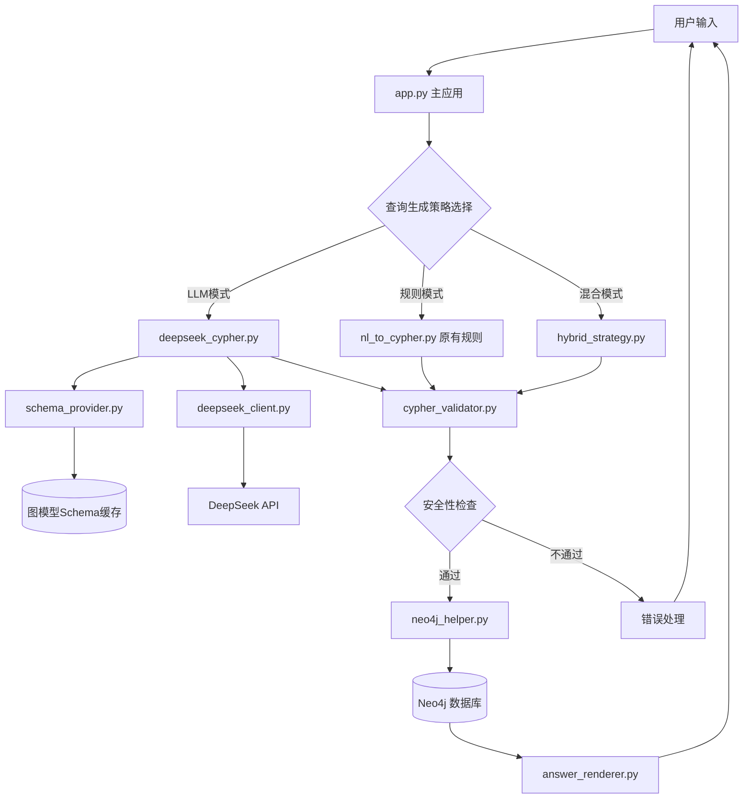
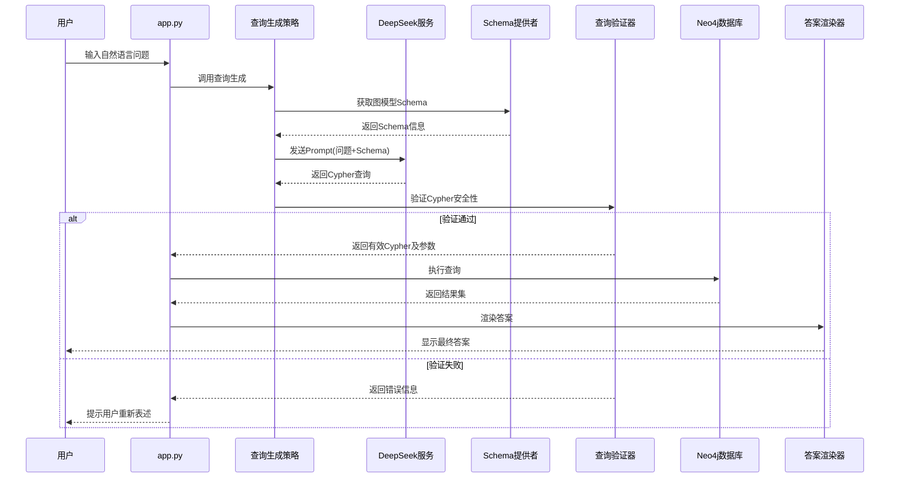
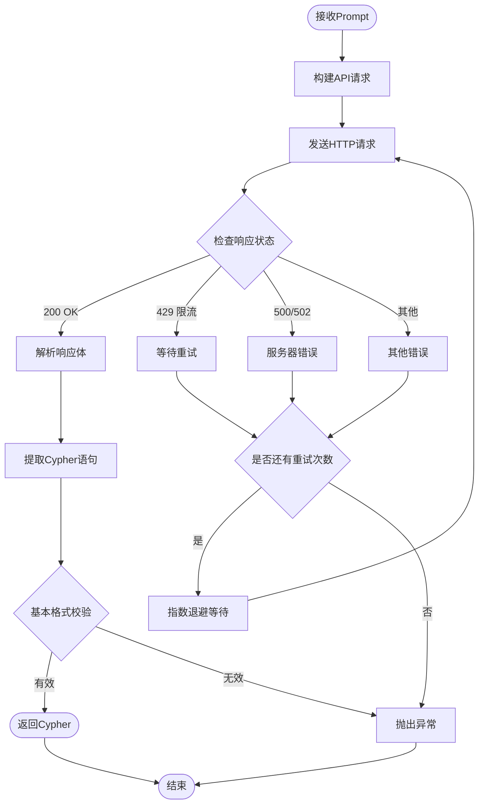
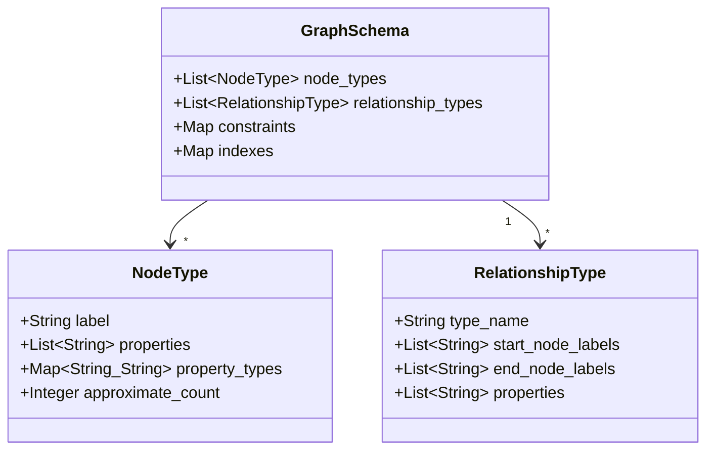
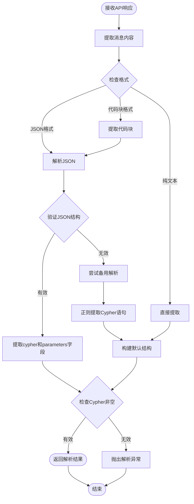
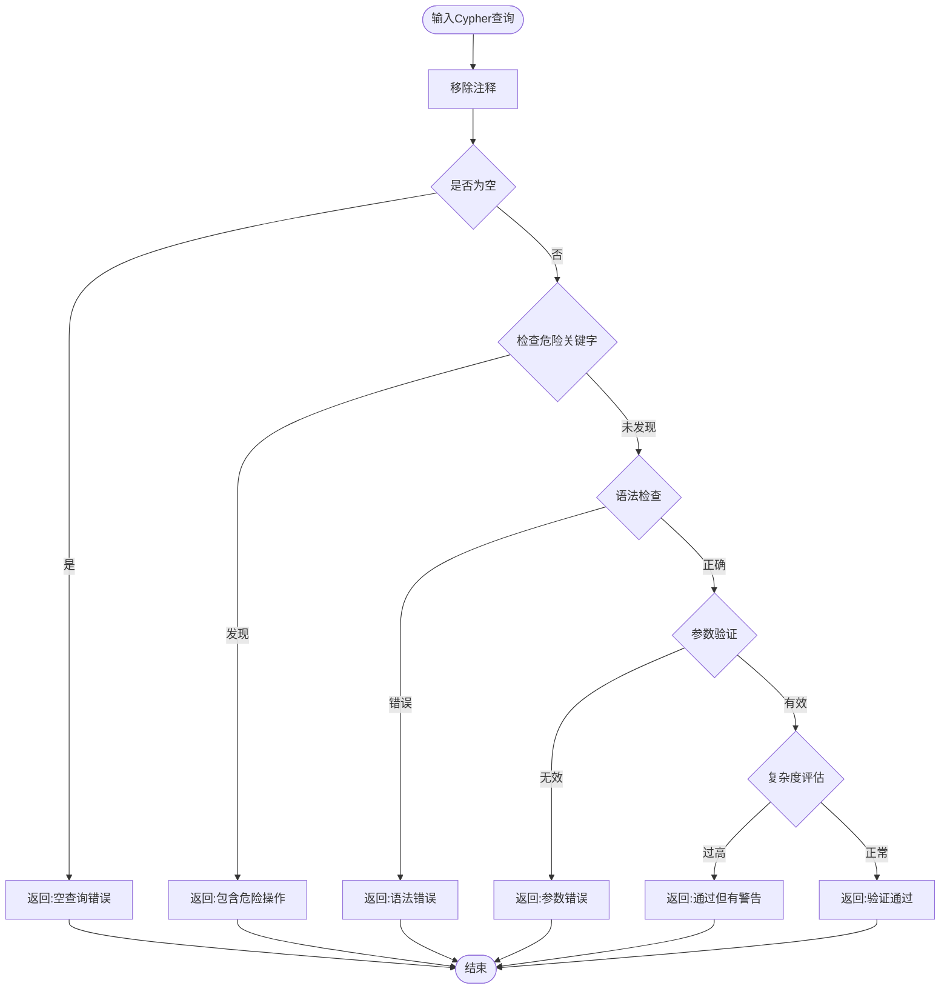
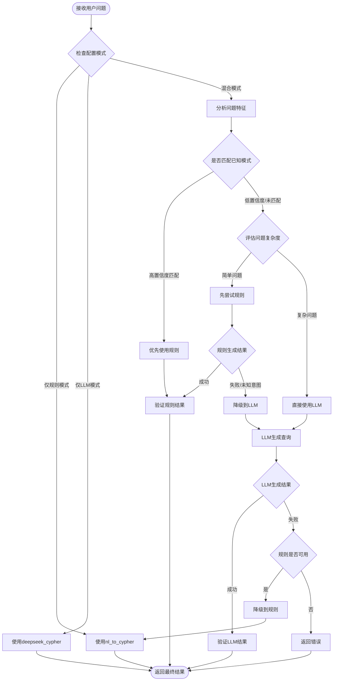
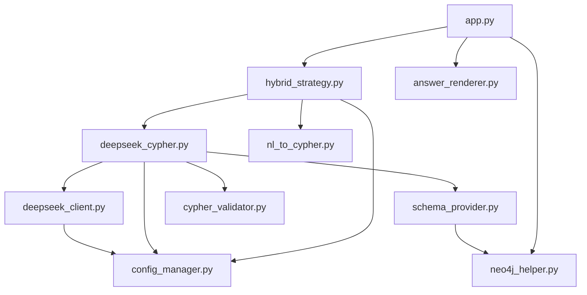
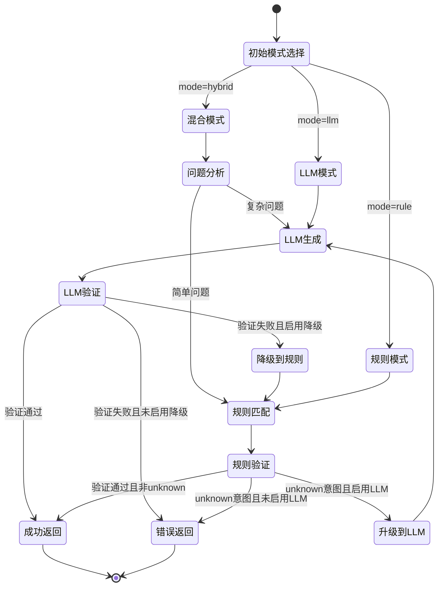
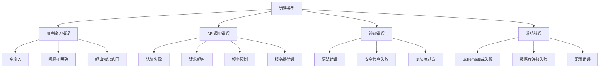

# 查询语句接入 DeepSeek API 设计文档

## 1. 概述

### 1.1 需求背景

现有系统使用基于正则表达式的规则匹配方式将用户的中文自然语言问题转换为 Cypher 查询语句。这种方式存在以下局限性：

- **扩展性差**：每新增一种查询类型,需手动编写正则表达式规则和 Cypher 模板
- **灵活性不足**：用户表述方式稍有变化,可能无法匹配现有规则
- **理解能力有限**：无法处理复杂的、组合性的查询需求
- **维护成本高**：规则增多后,模式冲突和维护难度增加

通过接入 DeepSeek API,利用大语言模型的自然语言理解和代码生成能力,可以实现更智能、更灵活的 Cypher 查询生成。

### 1.2 设计目标

- 将用户输入的自然语言问题通过 DeepSeek API 转换为准确的 Cypher 查询语句
- 保持现有系统架构的稳定性,最小化对其他模块的影响
- 提供降级机制,当 API 调用失败时回退到原有的规则匹配方式
- 支持知识图谱结构感知,生成符合实际数据模型的查询语句
- 确保查询的安全性,防止注入攻击

### 1.3 技术边界

本设计专注于自然语言到 Cypher 查询的转换逻辑,不涉及：

- DeepSeek API 的内部实现机制
- Neo4j 数据库的底层存储优化
- Streamlit 前端界面的重构
- 图数据库模型的变更

## 2. 系统架构

### 2.1 整体架构调整



### 2.2 核心模块职责

| 模块名称                | 职责描述                                           | 接口依赖                               |
| ----------------------- | -------------------------------------------------- | -------------------------------------- |
| **deepseek_client.py**  | 封装 DeepSeek API 调用逻辑,处理请求/响应/重试/超时 | DeepSeek API                           |
| **schema_provider.py**  | 提供图数据库 Schema 信息(节点类型、关系、属性)     | neo4j_helper.py                        |
| **deepseek_cypher.py**  | 构建 Prompt、调用 API、解析 Cypher 查询结果        | deepseek_client.py, schema_provider.py |
| **cypher_validator.py** | 验证生成的 Cypher 语句的语法和安全性               | 无                                     |
| **hybrid_strategy.py**  | 混合策略协调器,根据问题复杂度选择生成方式          | deepseek_cypher.py, nl_to_cypher.py    |
| **config_manager.py**   | 统一管理配置(API Key、模式选择、超时设置等)        | 环境变量/配置文件                      |

### 2.3 数据流程



## 3. 核心模块设计

### 3.1 DeepSeek API 客户端 (deepseek_client.py)

#### 职责定义

- 管理 API 连接和认证
- 构建符合 DeepSeek API 规范的请求体
- 处理响应解析和错误重试
- 实现请求限流和超时控制

#### 配置参数

| 参数名      | 类型    | 默认值                    | 说明                 |
| ----------- | ------- | ------------------------- | -------------------- |
| api_key     | String  | 环境变量 DEEPSEEK_API_KEY | API 认证密钥         |
| base_url    | String  | https://api.deepseek.com  | API 基础地址         |
| model_name  | String  | deepseek-chat             | 使用的模型名称       |
| timeout     | Integer | 30                        | 请求超时时间(秒)     |
| max_retries | Integer | 3                         | 失败重试次数         |
| temperature | Float   | 0.1                       | 生成温度(越低越确定) |
| max_tokens  | Integer | 2000                      | 最大生成 token 数    |

#### 核心接口

**generate_cypher 方法**

| 属性 | 说明                                                   |
| ---- | ------------------------------------------------------ |
| 输入 | prompt: String (包含问题和Schema的完整提示词)          |
| 输出 | cypher: String (生成的Cypher查询语句)                  |
| 异常 | APIConnectionError, APITimeoutError, APIRateLimitError |

**工作流程**



#### 请求体结构示例

```json
{
  "model": "deepseek-chat",
  "messages": [
    {
      "role": "system",
      "content": "你是一个专业的图数据库查询专家,专门将自然语言问题转换为Neo4j Cypher查询语句..."
    },
    {
      "role": "user", 
      "content": "问题：有哪些关于动态规划的题目\n\nSchema信息：..."
    }
  ],
  "temperature": 0.1,
  "max_tokens": 2000
}
```

### 3.2 Schema 提供者 (schema_provider.py)

#### 职责定义

- 从 Neo4j 数据库中自动提取图结构信息
- 缓存 Schema 信息以提升性能
- 将 Schema 格式化为易于 LLM 理解的文本描述

#### 提取的 Schema 信息



#### Schema 查询语句

**节点类型及属性**

```
查询目标：获取所有节点标签及其属性列表
Cypher语句：
CALL db.schema.nodeTypeProperties()
YIELD nodeType, nodeLabels, propertyName, propertyTypes, mandatory
RETURN nodeLabels, collect({property: propertyName, type: propertyTypes}) AS properties
```

**关系类型及方向**

```
查询目标：获取所有关系类型及其起止节点
Cypher语句：
CALL db.schema.relTypeProperties()
YIELD relType, propertyName, propertyTypes
RETURN relType, collect({property: propertyName, type: propertyTypes}) AS properties
```

**数据规模统计**

```
查询目标：统计各类型节点数量
Cypher语句：
CALL db.labels() YIELD label
CALL {
  WITH label
  MATCH (n) WHERE label IN labels(n)
  RETURN count(n) AS count
}
RETURN label, count
```

#### Schema 文本格式化

**格式化输出示例**

```
图数据库Schema信息：

【节点类型】
1. Problem (题目节点，约2000个)
   - id: String (题目唯一标识)
   - name: String (题目名称)
   - rating: Integer (难度评分)
   - source: String (来源)

2. Tag (标签节点，约150个)
   - id: String (标签ID)
   - name: String (标签名称，如"动态规划"、"图论")

3. Contest (比赛节点，约50个)
   - id: String (比赛ID)
   - name: String (比赛名称)

4. Team (队伍节点，约300个)
   - id: String (队伍ID)
   - name: String (队伍名称)

5. Person (人员节点，约500个)
   - id: String (人员ID)
   - name: String (人员姓名)

6. Solution (题解节点，约800个)
   - id: String (题解ID)
   - writer: String (作者)
   - content: String (题解内容)

【关系类型】
1. HAS_TAG: Problem -> Tag (题目包含标签)
2. HAS_SOLUTION: Problem -> Solution (题目有题解)
3. AUTHOR: Solution -> Person (题解作者)
4. PARTICIPATED_IN: Team -> Contest (队伍参加比赛)
5. PLACED: Team -> Contest (队伍在比赛中的名次)
   - rank: String (名次)
   - region: String (地区)
```

#### 缓存机制

| 缓存策略   | 说明                                    |
| ---------- | --------------------------------------- |
| 初始化加载 | 应用启动时一次性加载Schema              |
| 内存缓存   | 使用单例模式维护Schema对象              |
| 刷新触发   | 提供手动刷新接口,用于数据模型变更后更新 |
| 有效期     | 默认缓存永久有效,除非手动刷新           |

### 3.3 DeepSeek Cypher 生成器 (deepseek_cypher.py)

#### 职责定义

- 构建包含问题和 Schema 的完整 Prompt
- 调用 DeepSeek API 生成 Cypher 查询
- 解析 API 返回的 Cypher 语句和参数
- 提供意图识别能力(兼容原有系统)

#### Prompt 工程设计

**System Prompt (系统提示词)**

```
你是一个专业的Neo4j Cypher查询专家。你的任务是根据用户的中文自然语言问题和提供的图数据库Schema信息，生成准确、高效、安全的Cypher查询语句。

【核心要求】
1. 查询必须符合提供的Schema结构，不得使用不存在的节点标签、关系类型或属性
2. 使用参数化查询，将用户输入的实体名称作为参数（使用$parameter语法）
3. 对字符串匹配使用toLower()函数进行不区分大小写的匹配
4. 只返回Cypher查询语句和参数，不要包含任何解释说明
5. 如果问题不明确或无法生成有效查询，返回ERROR标记

【返回格式】
严格按照以下JSON格式返回：
{
  "cypher": "生成的Cypher查询语句",
  "parameters": {
    "param1": "value1",
    "param2": "value2"
  },
  "intent": "查询意图类型(可选)"
}

【安全规则】
- 禁止使用DELETE、DETACH DELETE、REMOVE、SET、CREATE、MERGE等修改操作
- 禁止使用LOAD CSV、CALL apoc.*等潜在危险操作
- 只允许使用MATCH、OPTIONAL MATCH、WHERE、RETURN、WITH、ORDER BY、LIMIT等只读操作
```

**User Prompt Template (用户提示词模板)**

```
【用户问题】
{user_question}

【图数据库Schema】
{schema_information}

【示例参考】
问题：题目"两数之和"的难度
Cypher: MATCH (p:Problem) WHERE toLower(p.name) CONTAINS toLower($problem) RETURN p.name AS name, p.rating AS rating LIMIT 10
Parameters: {"problem": "两数之和"}

问题：有哪些关于动态规划的题目
Cypher: MATCH (p:Problem)-[:HAS_TAG]->(t:Tag) WHERE toLower(t.name)=toLower($tag) RETURN p.name AS name, p.rating AS rating LIMIT 100
Parameters: {"tag": "动态规划"}

现在请根据用户问题生成Cypher查询。
```

#### 响应解析逻辑



#### 核心接口

**parse_question_to_cypher 方法**

| 属性 | 说明                                             |
| ---- | ------------------------------------------------ |
| 输入 | question: String (用户自然语言问题)              |
| 输出 | QueryResult对象 (包含cypher、parameters、intent) |
| 异常 | APIError, ParseError, ValidationError            |

**QueryResult 数据结构**

| 字段名     | 类型              | 说明                          |
| ---------- | ----------------- | ----------------------------- |
| cypher     | String            | 生成的Cypher查询语句          |
| parameters | Dict[String, Any] | 查询参数字典                  |
| intent     | String            | 查询意图类型(可选)            |
| confidence | Float             | 生成置信度(0-1,可选)          |
| source     | String            | 生成来源标识(llm/rule/hybrid) |

### 3.4 Cypher 验证器 (cypher_validator.py)

#### 职责定义

- 验证 Cypher 语句的语法正确性
- 检查是否包含危险操作(如删除、修改)
- 验证参数类型和格式
- 提供查询复杂度评估

#### 安全规则

**禁止操作清单**

| 操作类型 | 关键字                                | 风险说明              |
| -------- | ------------------------------------- | --------------------- |
| 删除操作 | DELETE, DETACH DELETE                 | 可能删除图数据        |
| 修改操作 | SET, REMOVE                           | 可能修改节点/关系属性 |
| 创建操作 | CREATE, MERGE                         | 可能创建新节点/关系   |
| 数据加载 | LOAD CSV                              | 可能加载外部文件      |
| 过程调用 | CALL apoc.*, CALL dbms.*              | 可能执行系统级操作    |
| 管理操作 | DROP, CREATE INDEX, CREATE CONSTRAINT | 可能修改数据库结构    |

**允许操作清单**

- MATCH (包括 OPTIONAL MATCH)
- WHERE
- RETURN
- WITH
- ORDER BY
- LIMIT / SKIP
- DISTINCT
- COUNT / SUM / AVG / MIN / MAX
- UNWIND
- 字符串函数 (toLower, toUpper, substring, etc.)
- 聚合函数

#### 验证流程



#### 语法检查策略

由于完整的 Cypher 语法解析器实现复杂,采用以下实用策略:

**基础语法检查**

- 括号匹配检查 (圆括号、方括号、花括号)
- 引号匹配检查 (单引号、双引号)
- 关键字大小写规范化
- 基本结构检查 (MATCH...RETURN, WITH...等)

**试执行验证 (可选)**

- 在测试环境中使用 EXPLAIN 命令验证查询计划
- 检查是否引用了不存在的标签或属性
- 评估查询的预估成本

#### 验证结果结构

| 字段名           | 类型         | 说明                                           |
| ---------------- | ------------ | ---------------------------------------------- |
| is_valid         | Boolean      | 是否通过验证                                   |
| error_type       | String       | 错误类型(syntax/security/parameter/complexity) |
| error_message    | String       | 详细错误信息                                   |
| warnings         | List[String] | 警告信息列表                                   |
| complexity_score | Integer      | 复杂度评分(1-10)                               |

### 3.5 混合策略协调器 (hybrid_strategy.py)

#### 职责定义

- 根据问题特征选择合适的查询生成方式
- 协调规则匹配和 LLM 生成两种模式
- 实现降级和备份机制
- 收集生成效果指标

#### 策略选择逻辑



#### 问题复杂度评估

**评估维度**

| 维度         | 简单特征         | 复杂特征            |
| ------------ | ---------------- | ------------------- |
| 查询实体数量 | 1-2个            | 3个及以上           |
| 关系深度     | 1-2层            | 3层及以上           |
| 条件数量     | 单条件           | 多条件组合(AND/OR)  |
| 聚合需求     | 无聚合           | 有聚合(COUNT/SUM等) |
| 排序需求     | 无排序           | 多字段排序          |
| 模式匹配难度 | 完全匹配已知模板 | 新颖表述方式        |

**复杂度评分规则**

```
基础分: 0
- 每个额外实体: +2分
- 每层关系深度: +3分
- 每个额外条件: +2分
- 包含聚合: +3分
- 包含排序: +1分
- 未匹配已知模板: +5分

判定:
- 0-5分: 简单问题 -> 优先规则
- 6-10分: 中等复杂 -> 规则尝试后降级
- 11分以上: 复杂问题 -> 直接LLM
```

#### 配置选项

| 配置项                | 类型    | 默认值 | 说明                       |
| --------------------- | ------- | ------ | -------------------------- |
| mode                  | Enum    | hybrid | 运行模式(rule/llm/hybrid)  |
| llm_fallback_enabled  | Boolean | true   | LLM失败时是否降级到规则    |
| rule_fallback_enabled | Boolean | true   | 规则失败时是否降级到LLM    |
| complexity_threshold  | Integer | 6      | 复杂度阈值,超过此值优先LLM |
| enable_cache          | Boolean | true   | 是否启用查询结果缓存       |
| cache_ttl             | Integer | 3600   | 缓存过期时间(秒)           |

#### 性能指标收集

**收集的指标**

- 规则匹配成功率
- LLM 生成成功率
- 平均响应时间(规则 vs LLM)
- 验证失败率
- 降级触发次数
- 用户满意度(可选,需结合反馈机制)

**指标存储格式**

| 字段               | 类型     | 说明                        |
| ------------------ | -------- | --------------------------- |
| timestamp          | DateTime | 查询时间                    |
| question           | String   | 原始问题                    |
| strategy_used      | String   | 使用的策略(rule/llm/hybrid) |
| success            | Boolean  | 是否成功生成                |
| response_time      | Float    | 响应时间(毫秒)              |
| fallback_triggered | Boolean  | 是否触发降级                |
| validation_passed  | Boolean  | 验证是否通过                |

## 4. 接入方案

### 4.1 模块集成方式

**文件组织结构**

```
src/
├── app.py (主应用,需修改)
├── nl_to_cypher.py (保留,作为规则引擎)
├── neo4j_helper.py (保留,无需修改)
├── answer_renderer.py (保留,无需修改)
├── deepseek/
│   ├── __init__.py
│   ├── deepseek_client.py (新增)
│   ├── schema_provider.py (新增)
│   ├── deepseek_cypher.py (新增)
│   ├── cypher_validator.py (新增)
│   └── hybrid_strategy.py (新增)
└── config/
    ├── __init__.py
    └── config_manager.py (新增)
```

**依赖关系**



### 4.2 app.py 修改方案

#### 原有逻辑

```
用户输入 -> parse_intent() -> get_cypher_and_params() -> run_query() -> render_answer()
```

#### 调整后逻辑

```
用户输入 -> hybrid_strategy.generate_query() -> run_query() -> render_answer()
```

#### 关键修改点

**配置初始化**

在应用启动时初始化配置和策略对象:

```
- 从环境变量读取 DEEPSEEK_API_KEY
- 从环境变量读取运行模式 QUERY_MODE (rule/llm/hybrid)
- 初始化 Schema 提供者(缓存图模型结构)
- 初始化混合策略协调器
- 保持原有 Neo4jHelper 初始化逻辑
```

**查询生成调用替换**

原有逻辑:
```
parsed = parse_intent(q)
cypher, params = get_cypher_and_params(parsed)
```

新逻辑:
```
query_result = hybrid_strategy.generate_query(q)
cypher = query_result.cypher
params = query_result.parameters
```

**错误处理增强**

```
尝试执行查询:
  如果生成失败 -> 显示友好错误提示
  如果验证失败 -> 提示用户重新表述
  如果数据库执行失败 -> 显示具体错误信息
  如果API调用失败 -> 自动降级到规则模式(如启用)
```

**界面信息展示**

在 Streamlit 界面添加以下信息展示:

- 使用的查询生成策略 (规则/LLM/混合)
- API 调用耗时 (如使用 LLM)
- 降级标识 (如触发降级)
- 验证结果 (通过/警告)

### 4.3 配置管理

#### 环境变量

| 变量名             | 必需        | 默认值                   | 说明                      |
| ------------------ | ----------- | ------------------------ | ------------------------- |
| DEEPSEEK_API_KEY   | 是(LLM模式) | 无                       | DeepSeek API 密钥         |
| NEO4J_URI          | 是          | bolt://localhost:7687    | Neo4j 数据库地址          |
| NEO4J_USER         | 是          | neo4j                    | 数据库用户名              |
| NEO4J_PASSWORD     | 是          | luogu20201208            | 数据库密码                |
| QUERY_MODE         | 否          | hybrid                   | 查询模式(rule/llm/hybrid) |
| DEEPSEEK_BASE_URL  | 否          | https://api.deepseek.com | API 基础地址              |
| DEEPSEEK_MODEL     | 否          | deepseek-chat            | 模型名称                  |
| DEEPSEEK_TIMEOUT   | 否          | 30                       | 超时时间(秒)              |
| ENABLE_QUERY_CACHE | 否          | true                     | 是否启用缓存              |
| LOG_LEVEL          | 否          | INFO                     | 日志级别                  |

#### 配置文件 (config.yaml, 可选)

```yaml
deepseek:
  api_key: ${DEEPSEEK_API_KEY}
  base_url: https://api.deepseek.com
  model: deepseek-chat
  timeout: 30
  max_retries: 3
  temperature: 0.1
  max_tokens: 2000

strategy:
  mode: hybrid
  complexity_threshold: 6
  llm_fallback_enabled: true
  rule_fallback_enabled: true
  enable_cache: true
  cache_ttl: 3600

validation:
  enable_syntax_check: true
  enable_security_check: true
  enable_complexity_check: true
  max_complexity_score: 8

logging:
  level: INFO
  format: "%(asctime)s - %(name)s - %(levelname)s - %(message)s"
  file: logs/query_generation.log
```

### 4.4 降级机制

#### 降级触发条件

| 场景                      | 降级策略              |
| ------------------------- | --------------------- |
| API 密钥未配置            | 自动切换到纯规则模式  |
| API 调用超时 (>30秒)      | 降级到规则模式        |
| API 返回错误 (500/502)    | 重试3次后降级         |
| API 返回限流 (429)        | 等待后重试,失败则降级 |
| LLM 生成的查询验证失败    | 降级到规则模式        |
| 规则模式返回 unknown 意图 | 升级到 LLM 模式       |

#### 降级流程



## 5. 数据模型

### 5.1 请求与响应结构

#### API 请求结构

| 字段路径           | 类型           | 必需 | 说明                            |
| ------------------ | -------------- | ---- | ------------------------------- |
| model              | String         | 是   | 模型名称                        |
| messages           | Array[Message] | 是   | 消息列表                        |
| messages[].role    | String         | 是   | 消息角色(system/user/assistant) |
| messages[].content | String         | 是   | 消息内容                        |
| temperature        | Float          | 否   | 生成温度(0-2)                   |
| max_tokens         | Integer        | 否   | 最大token数                     |
| top_p              | Float          | 否   | 核采样参数                      |
| frequency_penalty  | Float          | 否   | 频率惩罚                        |
| presence_penalty   | Float          | 否   | 存在惩罚                        |

#### API 响应结构

| 字段路径                  | 类型          | 说明                      |
| ------------------------- | ------------- | ------------------------- |
| id                        | String        | 响应ID                    |
| object                    | String        | 对象类型(chat.completion) |
| created                   | Integer       | 创建时间戳                |
| model                     | String        | 使用的模型                |
| choices                   | Array[Choice] | 生成结果列表              |
| choices[].index           | Integer       | 结果索引                  |
| choices[].message         | Message       | 生成的消息                |
| choices[].message.role    | String        | 角色(assistant)           |
| choices[].message.content | String        | 生成的内容                |
| choices[].finish_reason   | String        | 结束原因(stop/length/...) |
| usage                     | Object        | token使用统计             |
| usage.prompt_tokens       | Integer       | 提示词token数             |
| usage.completion_tokens   | Integer       | 生成token数               |
| usage.total_tokens        | Integer       | 总token数                 |

### 5.2 内部数据流转

#### QueryRequest (查询请求)

| 字段名     | 类型   | 说明                 |
| ---------- | ------ | -------------------- |
| question   | String | 用户原始问题         |
| context    | Dict   | 上下文信息(可选)     |
| force_mode | String | 强制使用的模式(可选) |
| user_id    | String | 用户标识(可选)       |
| session_id | String | 会话ID(可选)         |

#### QueryResult (查询结果)

| 字段名            | 类型              | 说明                      |
| ----------------- | ----------------- | ------------------------- |
| cypher            | String            | 生成的Cypher查询          |
| parameters        | Dict[String, Any] | 查询参数                  |
| intent            | String            | 查询意图(可选)            |
| confidence        | Float             | 置信度(0-1)               |
| source            | String            | 生成来源(rule/llm/hybrid) |
| generation_time   | Float             | 生成耗时(毫秒)            |
| validation_result | ValidationResult  | 验证结果                  |
| metadata          | Dict              | 其他元数据                |

#### ValidationResult (验证结果)

| 字段名           | 类型         | 说明             |
| ---------------- | ------------ | ---------------- |
| is_valid         | Boolean      | 是否有效         |
| error_type       | String       | 错误类型(可空)   |
| error_message    | String       | 错误详情(可空)   |
| warnings         | List[String] | 警告列表         |
| complexity_score | Integer      | 复杂度评分(1-10) |

## 6. 性能与优化

### 6.1 性能目标

| 指标             | 目标值      | 说明                   |
| ---------------- | ----------- | ---------------------- |
| LLM 查询生成耗时 | < 3秒 (P95) | 从发起请求到获得Cypher |
| 规则查询生成耗时 | < 50ms      | 规则匹配速度           |
| Schema 加载耗时  | < 500ms     | 应用启动时一次性       |
| 缓存命中率       | > 30%       | 相同问题重复查询       |
| API 调用成功率   | > 95%       | 包含重试后             |

### 6.2 优化策略

#### Schema 缓存优化

**策略描述**

- 应用启动时一次性加载完整 Schema 并缓存在内存
- 使用单例模式确保全局共享同一份 Schema 对象
- 提供手动刷新接口,仅在数据模型变更时调用

**预期收益**

- 每次查询生成节省 200-500ms 的 Schema 查询时间
- 减轻 Neo4j 数据库负载

#### 问题-查询缓存

**缓存键设计**

```
cache_key = hash(mode + question.lower().strip())
```

**缓存内容**

- Cypher 查询语句
- 参数字典
- 意图类型
- 生成来源

**缓存策略**

- LRU (最近最少使用) 淘汰策略
- 默认容量: 1000条
- 默认过期时间: 1小时
- 支持手动清除

**适用场景**

- 演示环境(用户重复查询相同问题)
- 常见问题快速响应

#### API 请求优化

**批量请求合并**

对于同一会话中的多个问题,可以考虑批量提交(需 DeepSeek API 支持)

**流式响应 (可选)**

如 API 支持流式返回,可逐步显示生成进度,提升用户体验

**超时与重试**

- 首次请求: 30秒超时
- 重试间隔: 指数退避 (1s, 2s, 4s)
- 最大重试: 3次

#### Prompt 优化

**精简 Schema 信息**

- 只包含与问题相关的节点和关系 (基于关键词匹配)
- 减少 token 消耗,降低成本和延迟

**Few-shot 示例优化**

- 提供 5-10 个典型示例覆盖常见查询模式
- 示例按复杂度排序,先简单后复杂

### 6.3 资源消耗估算

#### Token 消耗

**单次查询平均 Token 数**

| 部分          | Token 数      | 说明              |
| ------------- | ------------- | ----------------- |
| System Prompt | 300           | 固定系统提示词    |
| Schema 信息   | 800-1200      | 完整图模型描述    |
| Few-shot 示例 | 400-600       | 5-10个示例        |
| 用户问题      | 20-50         | 平均中文问题长度  |
| **输入总计**  | **1520-2150** | Prompt Tokens     |
| 生成的 Cypher | 100-300       | Completion Tokens |
| **总计**      | **1620-2450** | 单次查询          |

**月度成本估算 (假设)**

```
假设:
- 每日活跃用户: 100
- 每用户平均查询: 5次/日
- 每月查询总数: 100 * 5 * 30 = 15,000次
- 每次平均token: 2000
- 总token: 30,000,000 (3000万)

DeepSeek API 定价 (参考):
- 输入: ¥1/百万token
- 输出: ¥2/百万token

预估成本:
- 输入成本: 15000 * 1800 / 1,000,000 * 1 = ¥27
- 输出成本: 15000 * 200 / 1,000,000 * 2 = ¥6
- 月度总计: 约 ¥33
```

#### 缓存收益

如缓存命中率达到 30%:

- 实际 API 调用: 15,000 * 0.7 = 10,500次
- 节省成本: 33 * 0.3 = ¥10
- 月度成本: 约 ¥23

## 7. 错误处理

### 7.1 错误分类



### 7.2 错误处理策略

| 错误类型        | 处理策略        | 用户提示                                 |
| --------------- | --------------- | ---------------------------------------- |
| 空输入          | 直接拒绝        | "请输入您的问题"                         |
| 问题不明确      | 要求澄清        | "您的问题似乎不够明确,能否换个方式表述?" |
| API 认证失败    | 降级到规则模式  | "当前使用基础查询模式,功能受限"          |
| API 超时        | 重试后降级      | "查询响应较慢,已切换到快速模式"          |
| API 限流        | 等待后重试      | "请求过于频繁,请稍后再试"                |
| 语法错误        | 降级到规则模式  | "查询生成失败,尝试使用备用方式"          |
| 安全检查失败    | 拒绝执行        | "该查询可能存在安全风险,已拒绝"          |
| Schema 加载失败 | 使用默认 Schema | "图模型信息不完整,查询可能受限"          |
| 数据库连接失败  | 终止查询        | "数据库连接失败,请联系管理员"            |

### 7.3 日志记录

#### 日志级别

| 级别     | 记录内容                                   |
| -------- | ------------------------------------------ |
| DEBUG    | API请求/响应详情、Schema加载详情、验证过程 |
| INFO     | 查询生成成功、策略选择、缓存命中           |
| WARNING  | 降级触发、验证警告、性能阈值超标           |
| ERROR    | API调用失败、验证失败、数据库错误          |
| CRITICAL | 系统级错误(Schema加载失败、配置错误)       |

#### 日志格式

```
时间戳 | 级别 | 模块 | 会话ID | 消息

示例:
2024-01-15 14:23:45 | INFO | deepseek_cypher | sess_abc123 | Query generated successfully via LLM (2.3s)
2024-01-15 14:23:47 | WARNING | hybrid_strategy | sess_abc123 | LLM validation failed, fallback to rule mode
2024-01-15 14:23:50 | ERROR | deepseek_client | sess_xyz789 | API request timeout after 3 retries
```

## 8. 测试策略

### 8.1 单元测试

#### 测试覆盖范围

| 模块                | 测试内容                                  |
| ------------------- | ----------------------------------------- |
| deepseek_client.py  | API请求构建、响应解析、重试逻辑、错误处理 |
| schema_provider.py  | Schema提取、格式化、缓存机制              |
| deepseek_cypher.py  | Prompt构建、响应解析、意图识别            |
| cypher_validator.py | 安全检查、语法检查、参数验证              |
| hybrid_strategy.py  | 策略选择逻辑、降级机制、复杂度评估        |

#### 测试用例示例

**deepseek_client 测试**

- 测试正常API调用返回正确结果
- 测试超时后正确抛出异常
- 测试限流错误触发重试
- 测试认证失败正确处理
- 测试响应格式错误的容错性

**cypher_validator 测试**

- 测试检测 DELETE 操作
- 测试检测 CREATE 操作
- 测试允许正常的 MATCH 查询
- 测试括号不匹配检测
- 测试复杂度评分准确性

### 8.2 集成测试

#### 测试场景

**端到端流程测试**

```
输入: "有哪些关于动态规划的题目"
预期流程:
1. hybrid_strategy 分析问题
2. 选择LLM模式或规则模式
3. 生成Cypher查询
4. 验证通过
5. 执行查询返回结果
6. 渲染为中文答案
```

**降级机制测试**

```
场景: 模拟API超时
预期:
1. LLM调用超时
2. 触发降级到规则模式
3. 规则成功生成查询
4. 返回正确结果
```

**Schema集成测试**

```
场景: 实际连接Neo4j数据库
预期:
1. 成功提取所有节点标签
2. 成功提取所有关系类型
3. Schema缓存生效
4. 格式化输出正确
```

### 8.3 性能测试

#### 测试指标

- 单次LLM查询生成耗时
- 单次规则查询生成耗时
- 缓存命中率
- 并发请求处理能力
- 降级响应时间

#### 测试方法

**基准测试**

使用固定的 100 个测试问题,测量:

- 每个问题的平均响应时间
- P95 和 P99 响应时间
- 成功率
- 降级触发率

**压力测试**

模拟 50 个并发用户,每用户发起 10 次查询:

- 观察系统响应时间变化
- 监控错误率
- 检查缓存效果

## 9. 部署与运维

### 9.1 部署前准备

#### 环境依赖

**Python 包依赖**

| 包名          | 版本要求  | 用途         |
| ------------- | --------- | ------------ |
| requests      | >= 2.28.0 | HTTP 请求    |
| pyyaml        | >= 6.0    | 配置文件解析 |
| python-dotenv | >= 0.19.0 | 环境变量管理 |
| cachetools    | >= 5.0.0  | 缓存实现     |
| tenacity      | >= 8.0.0  | 重试机制     |

**已有依赖 (保持)**

- streamlit
- neo4j
- 其他现有依赖

#### 配置检查清单

- [ ] DeepSeek API Key 已配置
- [ ] Neo4j 数据库连接正常
- [ ] 运行模式已设置 (rule/llm/hybrid)
- [ ] 日志目录已创建且有写权限
- [ ] Schema 缓存目录已创建
- [ ] 环境变量或配置文件已正确设置

### 9.2 部署步骤

**步骤 1: 安装新依赖**

```
更新 requirements.txt 文件
执行: pip install -r requirements.txt
```

**步骤 2: 配置环境变量**

创建 .env 文件或设置系统环境变量

**步骤 3: 初始化 Schema**

首次运行时会自动加载 Schema,确保 Neo4j 已启动且可访问

**步骤 4: 测试运行**

使用测试模式验证功能:
- 设置 QUERY_MODE=rule 测试规则模式
- 设置 QUERY_MODE=llm 测试 LLM 模式
- 设置 QUERY_MODE=hybrid 测试混合模式

**步骤 5: 正式部署**

启动 Streamlit 应用,监控日志输出

### 9.3 监控与告警

#### 关键监控指标

| 指标类别   | 具体指标                                |
| ---------- | --------------------------------------- |
| 性能指标   | API响应时间、数据库查询时间、缓存命中率 |
| 可用性指标 | API调用成功率、降级触发频率、验证失败率 |
| 业务指标   | 查询总数、用户活跃度、问题类型分布      |
| 资源指标   | Token消耗量、API调用次数、缓存内存占用  |

#### 告警规则

| 告警条件           | 严重级别 | 处理建议                      |
| ------------------ | -------- | ----------------------------- |
| API连续失败 > 5次  | 高       | 检查API服务状态、网络连接     |
| 降级触发率 > 50%   | 中       | 优化Prompt、检查API配额       |
| 验证失败率 > 30%   | 中       | 检查LLM生成质量、调整温度参数 |
| 平均响应时间 > 5秒 | 低       | 优化Schema大小、调整缓存策略  |

### 9.4 故障恢复

#### 常见故障与处理

**API 服务不可用**

```
现象: 所有LLM请求失败
处理:
1. 检查API服务状态
2. 检查网络连接
3. 临时切换到纯规则模式
4. 通知用户功能受限
```

**数据库连接中断**

```
现象: 所有查询执行失败
处理:
1. 重启Neo4j数据库
2. 检查数据库配置
3. 清除Schema缓存并重新加载
4. 重启应用
```

**缓存数据损坏**

```
现象: 缓存命中后返回错误结果
处理:
1. 清空缓存目录
2. 重启应用重新构建缓存
3. 检查缓存序列化逻辑
```

## 10. 扩展与优化方向

### 10.1 近期优化

**Prompt 持续优化**

- 收集 LLM 生成失败的案例
- 分析失败原因并优化 Prompt
- A/B 测试不同 Prompt 策略的效果

**Schema 动态裁剪**

- 根据问题关键词智能筛选相关节点和关系
- 减少 Prompt 长度,降低成本和延迟
- 提升生成准确性

**用户反馈机制**

- 添加"查询结果是否有用"的评分按钮
- 收集低分查询案例用于模型优化
- 建立问题-查询质量数据集

### 10.2 长期规划

**多轮对话支持**

- 维护会话上下文
- 支持澄清性提问
- 支持追问和细化查询

**自定义知识注入**

- 允许用户补充领域特定知识
- 动态调整 Prompt 包含用户自定义信息

**多模型对比**

- 同时支持 DeepSeek、GPT、Claude 等多个模型
- 对比不同模型的生成效果
- 根据问题类型自动选择最佳模型

**查询优化建议**

- LLM 不仅生成查询,还提供优化建议
- 识别可能的性能瓶颈
- 建议添加索引或调整数据模型

### 10.3 可插拔架构

**接口抽象**

将查询生成器抽象为统一接口:

```
接口: QueryGenerator
方法:
  - generate_query(question: str) -> QueryResult
  - validate_query(cypher: str) -> ValidationResult
  - get_capabilities() -> List[String]

实现类:
  - RuleBasedGenerator (规则引擎)
  - DeepSeekGenerator (DeepSeek LLM)
  - GPTGenerator (OpenAI GPT)
  - LocalModelGenerator (本地开源模型)
```

**策略工厂模式**

根据配置动态选择和加载不同的生成器:

```
工厂类: QueryGeneratorFactory
方法:
  - create_generator(mode: str) -> QueryGenerator
  - register_generator(name: str, generator_class: Type)

使用:
generator = QueryGeneratorFactory.create_generator(config.mode)
result = generator.generate_query(question)
```

## 11. 风险与应对

### 11.1 技术风险

| 风险项             | 影响 | 概率 | 应对措施                       |
| ------------------ | ---- | ---- | ------------------------------ |
| API 服务不稳定     | 高   | 中   | 实现降级机制、缓存策略、多重试 |
| LLM 生成质量不稳定 | 中   | 中   | 验证机制、Prompt优化、多轮生成 |
| Token 成本超预算   | 中   | 低   | 缓存、Schema裁剪、成本监控     |
| 查询安全性漏洞     | 高   | 低   | 严格验证、白名单机制、沙箱测试 |

### 11.2 业务风险

| 风险项               | 影响 | 概率 | 应对措施                       |
| -------------------- | ---- | ---- | ------------------------------ |
| 用户问题超出知识范围 | 中   | 高   | 明确系统能力边界、引导用户     |
| 响应时间过长影响体验 | 中   | 中   | 优化Prompt、异步处理、进度提示 |
| 依赖外部服务可用性   | 高   | 低   | 降级机制、SLA保障、备用方案    |

### 11.3 合规风险

**数据隐私**

- 用户问题可能包含敏感信息,需明确告知并征得同意
- 不将敏感数据发送到外部 API (可脱敏处理)

**服务条款**

- 遵守 DeepSeek API 的使用条款
- 避免滥用 API 导致账号封禁

**知识产权**

- LLM 生成的 Cypher 查询归属问题
- 确保不侵犯他人知识产权

## 12. 总结

### 12.1 核心价值

- **智能化提升**: 从规则匹配升级到自然语言理解,支持更灵活的查询表述
- **扩展性增强**: 新增查询类型无需编写规则,LLM 自动适应
- **可靠性保障**: 降级机制确保在 API 不可用时系统仍可工作
- **成本可控**: 通过缓存和 Schema 优化控制 API 调用成本

### 12.2 实施路径

**阶段 1: 基础集成 (1-2周)**

- 实现 deepseek_client 和 schema_provider
- 实现 deepseek_cypher 基础功能
- 修改 app.py 支持 LLM 模式

**阶段 2: 混合策略 (1周)**

- 实现 cypher_validator
- 实现 hybrid_strategy
- 添加降级机制

**阶段 3: 优化与测试 (1-2周)**

- 实现缓存机制
- 完成单元测试和集成测试
- Prompt 优化和性能调优

**阶段 4: 上线与监控 (持续)**

- 部署到生产环境
- 监控关键指标
- 根据反馈持续优化

### 12.3 成功标准

- LLM 模式查询成功率 > 85%
- 平均响应时间 < 3秒
- 降级机制可靠运行
- 月度成本在预算范围内
- 用户满意度提升
