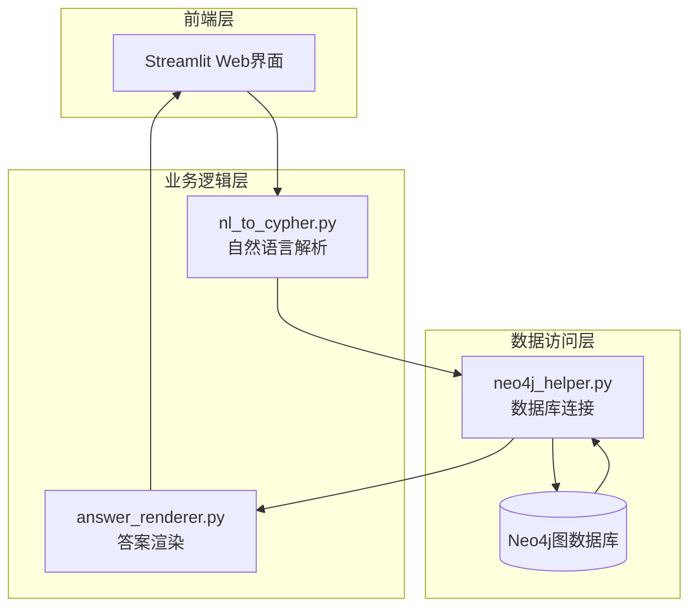
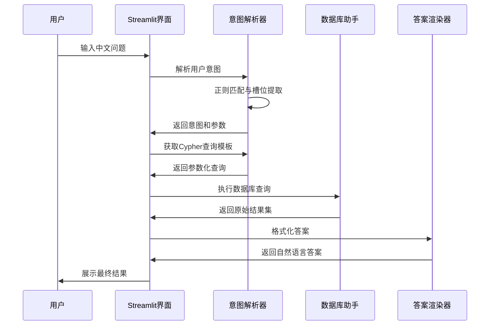
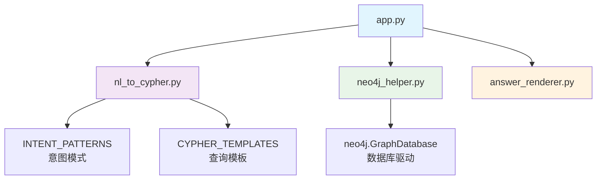
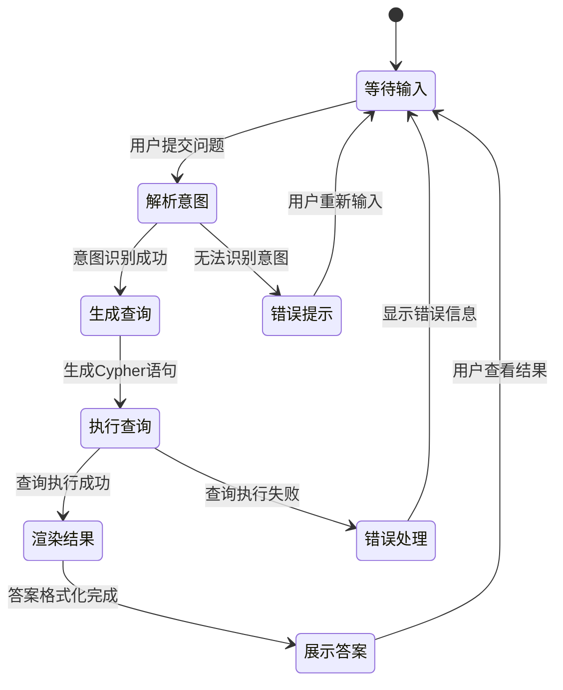

# ACM-ICPC知识图谱项目Wiki重构设计

## 概述

本设计文档旨在重新构建ACM-ICPC知识图谱项目的完整Wiki文档体系，为开发者和用户提供清晰、全面的项目信息。项目是一个基于Neo4j图数据库和Streamlit前端框架的自然语言问答系统，专注于ACM-ICPC竞赛相关知识的智能检索。

## 技术栈架构

### 核心技术组件

| 技术组件 | 版本 | 作用 | 选型理由 |
|---------|------|------|---------|
| Streamlit | 1.30.0 | Web前端框架 | 快速构建交互式Web应用，声明式API，无需前端开发知识 |
| Neo4j | 5.9.0 | 图数据库驱动 | 高效处理复杂关系查询，Cypher语言直观，适合知识图谱场景 |
| Python | 3.9 | 运行环境 | 丰富的数据科学生态，与选定框架兼容性良好 |

### 技术协同架构



### 数据流程设计



## 系统架构设计

### 组件层次结构

系统采用经典的三层架构模式，实现清晰的职责分离：

#### 表示层 (Presentation Layer)
- **主要组件**: app.py
- **功能职责**: 
  - 提供用户交互界面
  - 接收用户输入问题
  - 展示查询结果和调试信息
  - 协调各业务组件的调用

#### 业务逻辑层 (Business Logic Layer)
- **主要组件**: 
  - nl_to_cypher.py (自然语言处理)
  - answer_renderer.py (结果渲染)
- **功能职责**:
  - 意图识别与槽位提取
  - Cypher查询模板生成
  - 结果格式化与自然语言生成

#### 数据访问层 (Data Access Layer)
- **主要组件**: neo4j_helper.py
- **功能职责**:
  - 数据库连接管理
  - 查询执行与会话控制
  - 异常处理与资源释放

### 模块依赖关系



## 核心功能模块

### 自然语言处理模块

#### 意图识别机制
- **实现方式**: 基于正则表达式的模式匹配
- **支持意图类型**:
  - 题目信息查询
  - 题解检索
  - 选手信息查询
  - 比赛数据查询
  - 标签相关查询

#### 槽位提取策略
- **参数捕获**: 使用正则分组提取关键实体
- **类型验证**: 确保提取参数的格式正确性
- **默认值处理**: 为可选参数提供合理默认值

### 数据库交互模块

#### 连接管理策略
- **会话控制**: 自动管理数据库会话生命周期
- **参数配置**: 支持环境变量覆盖默认连接参数
- **异常恢复**: 实现连接断开后的自动重连机制

#### 查询执行流程
- **参数绑定**: 使用参数化查询防止注入攻击
- **结果转换**: 将Neo4j记录转换为Python数据结构
- **性能优化**: 合理使用索引和查询优化技巧

### 答案渲染模块

#### 渲染策略设计
- **意图驱动**: 根据不同查询意图采用不同渲染模板
- **格式化规则**: 统一的文本格式化和数据展示标准
- **可扩展性**: 支持新增意图类型的渲染逻辑

## API接口设计

### 内部API规范

#### 意图解析接口
```
函数: parse_intent(question: str) -> Dict
输入: 用户中文问题字符串
输出: {
  "intent": "意图类型",
  "params": {槽位参数字典},
  "confidence": 匹配置信度
}
```

#### 查询生成接口
```
函数: get_cypher_and_params(intent_data: Dict) -> Tuple
输入: 意图解析结果字典
输出: (cypher_query: str, parameters: Dict)
```

#### 数据库查询接口
```
方法: Neo4jHelper.run_query(cypher: str, parameters: Dict) -> List
输入: Cypher查询语句和参数字典
输出: 查询结果记录列表
```

#### 答案渲染接口
```
函数: render_answer(intent: str, data: List) -> str
输入: 意图类型和查询结果数据
输出: 格式化的自然语言答案
```

## 数据模型设计

### 图数据库模式

#### 节点类型定义
| 节点标签 | 属性字段 | 说明 |
|---------|---------|------|
| Problem | id, title, difficulty, description | 竞赛题目信息 |
| Solution | id, content, author, language | 题解内容 |
| Contestant | id, name, country, school | 参赛选手信息 |
| Contest | id, name, year, location | 比赛信息 |
| Tag | id, name, category | 题目标签分类 |

#### 关系类型定义
| 关系类型 | 起始节点 | 终止节点 | 属性 | 说明 |
|---------|---------|---------|------|------|
| HAS_SOLUTION | Problem | Solution | created_at | 题目包含题解 |
| TAGGED_WITH | Problem | Tag | weight | 题目标签关联 |
| PARTICIPATED_IN | Contestant | Contest | rank, score | 参赛关系 |
| SOLVED_BY | Problem | Contestant | time, attempts | 解题记录 |

### 查询模板架构

#### 模板分类体系
- **单实体查询**: 查询特定节点的详细信息
- **关系遍历查询**: 跨节点的多跳关系查询
- **聚合统计查询**: 基于关系的统计分析
- **条件过滤查询**: 基于属性的条件筛选

## 测试策略设计

### 单元测试架构

#### 测试覆盖范围
- **意图解析测试**: 验证正则匹配的准确性和完整性
- **数据库连接测试**: 测试连接建立、查询执行和异常处理
- **答案渲染测试**: 验证不同意图下的渲染输出格式

#### 测试数据策略
- **模拟数据集**: 构建小规模测试图数据
- **边界案例**: 测试空结果、异常输入等边界情况
- **性能基准**: 建立查询响应时间的性能基线

### 集成测试设计

#### 端到端测试流程
- **完整链路测试**: 从用户输入到最终输出的全流程验证
- **异常场景测试**: 网络异常、数据库不可用等异常情况
- **用户体验测试**: 验证界面响应和错误提示的友好性

## 扩展开发指南

### 新功能集成策略

#### 添加新查询类型
1. **意图模式扩展**: 在INTENT_PATTERNS中添加新的正则规则
2. **查询模板定义**: 在CYPHER_TEMPLATES中定义对应的Cypher模板
3. **渲染逻辑实现**: 在answer_renderer.py中添加新意图的渲染逻辑
4. **测试用例补充**: 为新功能编写完整的测试用例

#### 性能优化方向
- **查询缓存**: 实现常用查询的结果缓存机制
- **异步处理**: 使用异步IO提升并发处理能力
- **索引优化**: 根据查询模式优化数据库索引策略

### 架构演进路径

#### 智能化升级
- **机器学习集成**: 使用预训练模型替代正则表达式进行意图识别
- **知识图谱推理**: 实现基于图结构的智能推理能力
- **个性化推荐**: 根据用户历史查询提供个性化内容推荐

#### 部署与运维
- **容器化部署**: 使用Docker容器化应用和数据库
- **监控告警**: 实现应用性能监控和异常告警机制
- **数据备份**: 建立图数据库的定期备份和恢复策略

## 配置管理设计

### 环境配置策略

#### 数据库连接配置
| 环境变量 | 默认值 | 说明 |
|---------|--------|------|
| NEO_URI | bolt://localhost:7687 | Neo4j数据库连接URI |
| NEO_USER | neo4j | 数据库用户名 |
| NEO_PWD | password | 数据库密码 |

#### 应用配置参数
- **查询超时设置**: 控制数据库查询的最大执行时间
- **结果数量限制**: 限制单次查询返回的最大记录数
- **缓存配置**: 设置查询结果缓存的过期时间和存储策略

### 部署环境适配

#### 开发环境配置
- **本地数据库**: 使用Neo4j Desktop或Docker运行本地实例
- **调试模式**: 启用详细的日志输出和错误堆栈信息
- **热重载**: 配置代码变更后的自动重载机制

#### 生产环境配置
- **集群部署**: 配置Neo4j集群以提供高可用性
- **安全设置**: 启用SSL加密和访问控制
- **性能调优**: 根据负载特征调整JVM和数据库参数

## 用户体验设计

### 界面交互流程

#### 查询执行过程展示


#### 调试信息展示策略
- **分步骤展示**: 显示意图解析、查询生成、数据库执行各阶段结果
- **格式化输出**: 使用代码块展示Cypher语句，使用表格展示结构化数据
- **错误友好提示**: 将技术错误转换为用户友好的提示信息

### 可访问性设计

#### 多语言支持准备
- **国际化框架**: 为未来支持多语言做好架构准备
- **文本资源管理**: 统一管理界面文本和提示信息
- **语言检测**: 自动检测用户输入的语言类型

## 维护与监控

### 系统健康监控

#### 关键指标监控
- **查询响应时间**: 监控平均响应时间和99分位延迟
- **数据库连接状态**: 监控连接池使用情况和连接异常
- **错误率统计**: 统计各类错误的发生频率和趋势

#### 日志管理策略
- **结构化日志**: 使用JSON格式记录结构化日志信息
- **日志级别**: 合理设置不同环境下的日志输出级别
- **日志轮转**: 实现日志文件的自动轮转和清理机制

### 故障排查指南

#### 常见问题诊断
- **数据库连接失败**: 检查网络连通性、认证信息和防火墙设置
- **查询超时**: 分析查询复杂度和数据库性能指标
- **意图识别失败**: 验证正则表达式和用户输入格式

#### 性能调优建议
- **查询优化**: 分析慢查询并优化Cypher语句
- **索引策略**: 根据查询模式创建合适的数据库索引
- **缓存策略**: 实现多层缓存以减少数据库压力