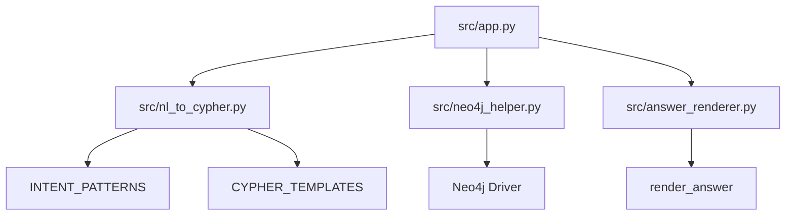

# 快速开始指南

<cite>
**本文档中引用的文件**  
- [requirements.txt](file://requirements.txt)
- [src/app.py](file://src/app.py)
- [src/neo4j_helper.py](file://src/neo4j_helper.py)
- [src/nl_to_cypher.py](file://src/nl_to_cypher.py)
- [src/answer_renderer.py](file://src/answer_renderer.py)
</cite>

## 目录
1. [简介](#简介)
2. [前提条件](#前提条件)
3. [部署步骤](#部署步骤)
4. [运行与访问](#运行与访问)
5. [执行一次查询](#执行一次查询)
6. [常见问题与解决方案](#常见问题与解决方案)
7. [组件依赖关系](#组件依赖关系)

## 简介
本指南旨在帮助新手开发者快速在本地部署并运行ACM-ICPC知识图谱问答系统。该系统基于Neo4j图数据库，通过自然语言处理将中文问题转换为Cypher查询语句，并以结构化方式返回结果。整个过程可在10分钟内完成，适合快速测试与演示。

## 前提条件
在开始部署前，请确保满足以下条件：
- **Python版本**：已安装Python 3.8或更高版本。
- **Neo4j数据库**：已安装并启动Neo4j 5.x实例，且数据库中已导入ACM-ICPC相关的节点与关系数据（如`Problem`、`Contest`、`Team`、`Tag`等）。
- **网络连接**：本地开发环境可访问Neo4j服务（默认端口7687）。

## 部署步骤

### 1. 克隆仓库
首先，将项目代码克隆到本地：
```bash
git clone https://github.com/example/ACM-ICPC-Knowlege-graph.git
cd ACM-ICPC-Knowlege-graph
```

### 2. 安装依赖
项目依赖通过`requirements.txt`文件管理。执行以下命令安装所有必需的Python包：
```bash
pip install -r requirements.txt
```

该文件包含以下核心依赖：
- `neo4j==5.9.0`：用于连接和操作Neo4j数据库的官方Python驱动。
- `streamlit==1.30.0`：用于构建Web用户界面的轻量级框架。

**Section sources**
- [requirements.txt](file://requirements.txt#L1-L3)

### 3. 配置数据库连接
系统通过环境变量或代码默认值配置Neo4j连接参数。您可以通过以下两种方式之一进行配置：

**方式一：使用环境变量（推荐）**
在运行程序前，设置以下环境变量：
```bash
export NEO_URI=bolt://your-neo4j-host:7687
export NEO_USER=your_username
export NEO_PWD=your_password
```

**方式二：修改代码默认值**
打开`src/app.py`文件，找到以下代码段并修改默认值：
```python
NEO_URI = os.getenv("NEO_URI", "bolt://localhost:7687")
NEO_USER = os.getenv("NEO_USER", "neo4j")
NEO_PWD = os.getenv("NEO_PWD", "luogu20201208")
```

这些参数将传递给`Neo4jHelper`类用于建立数据库连接。

**Section sources**
- [src/app.py](file://src/app.py#L8-L11)
- [src/neo4j_helper.py](file://src/neo4j_helper.py#L5-L6)

## 运行与访问

### 1. 启动主程序
在项目根目录下执行以下命令启动Streamlit应用：
```bash
streamlit run src/app.py
```

### 2. 访问Web界面
启动成功后，Streamlit会自动打开浏览器或在终端输出访问地址。默认情况下，Web界面可通过以下地址访问：
```
http://localhost:8501
```

页面标题为“ACM/ICPC KG 智能问答（课程演示）”，包含一个文本输入框用于输入中文问题。

**Section sources**
- [src/app.py](file://src/app.py#L6-L7)

## 执行一次查询

### 1. 输入问题
在Web界面的输入框中输入一个示例问题，例如：
```
2023年ICPC区域赛冠军是谁
```

### 2. 提交查询
点击“查询”按钮，系统将执行以下流程：
1. **意图解析**：调用`parse_intent`函数，使用正则表达式匹配问题意图。
2. **生成Cypher**：根据解析出的意图和槽位，从`CYPHER_TEMPLATES`中获取对应的Cypher查询模板。
3. **执行查询**：通过`Neo4jHelper`实例连接数据库并执行Cypher语句。
4. **渲染答案**：将查询结果传递给`render_answer`函数，生成自然语言形式的答案。

### 3. 查看结果
对于上述问题，系统将显示：
- **解析结果**：意图为`get_contest_winner`，槽位为`{"year_or_name": "2023"}`
- **执行Cypher**：显示实际执行的Cypher语句及参数
- **原始结果**：以表格形式展示前50条查询结果
- **生成的答案**：格式化后的文本，例如“冠军/第一名：\n清华大学代表队（地区：亚洲赛区，名次：1st）”

**Section sources**
- [src/app.py](file://src/app.py#L13-L44)
- [src/nl_to_cypher.py](file://src/nl_to_cypher.py#L29-L46)
- [src/neo4j_helper.py](file://src/neo4j_helper.py#L8-L12)
- [src/answer_renderer.py](file://src/answer_renderer.py#L3-L30)

## 常见问题与解决方案

### 1. 依赖冲突
**问题**：`pip install`时报错，提示版本冲突。
**解决方案**：建议使用虚拟环境隔离依赖：
```bash
python -m venv venv
source venv/bin/activate  # Linux/Mac
# 或 venv\Scripts\activate  # Windows
pip install -r requirements.txt
```

### 2. 数据库连接失败
**问题**：启动时报错`Connection refused`或`Authentication failed`。
**解决方案**：
- 确认Neo4j服务已启动且监听端口为7687。
- 检查`NEO_URI`、`NEO_USER`、`NEO_PWD`配置是否正确。
- 确保Neo4j数据库中已存在所需的数据模型。

### 3. 权限错误
**问题**：Windows系统下`streamlit`命令无法执行。
**解决方案**：以管理员身份运行命令行，或使用`python -m streamlit run src/app.py`。

### 4. 查询无结果
**问题**：输入问题后返回“未找到匹配的结果”。
**解决方案**：
- 检查数据库中是否存在相关数据。
- 确认问题表述与`INTENT_PATTERNS`中的正则表达式匹配（如包含“冠军”、“题目”等关键词）。

## 组件依赖关系
以下是系统核心组件之间的依赖关系图：



**Diagram sources**
- [src/app.py](file://src/app.py#L2-L5)
- [src/nl_to_cypher.py](file://src/nl_to_cypher.py#L4-L27)
- [src/neo4j_helper.py](file://src/neo4j_helper.py#L1-L17)
- [src/answer_renderer.py](file://src/answer_renderer.py#L1-L32)