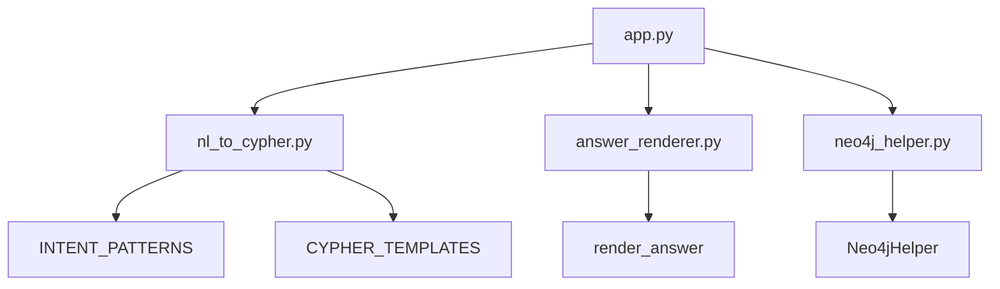
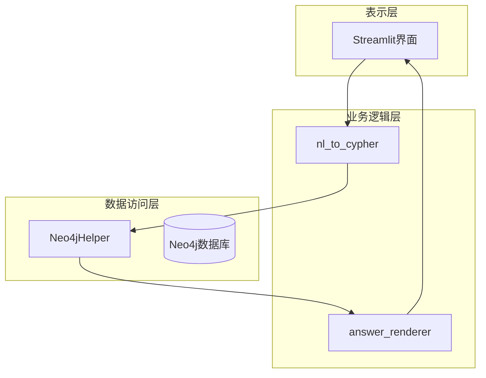
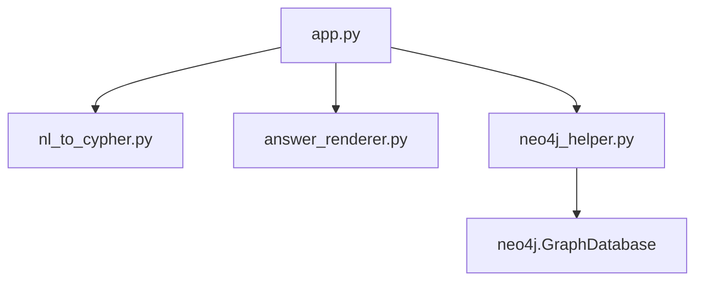

# 扩展开发指南

<cite>
**本文档中引用的文件**  
- [nl_to_cypher.py](file://src/nl_to_cypher.py)
- [answer_renderer.py](file://src/answer_renderer.py)
- [neo4j_helper.py](file://src/neo4j_helper.py)
- [app.py](file://src/app.py)
</cite>

## 目录
1. [简介](#简介)
2. [项目结构](#项目结构)
3. [核心组件](#核心组件)
4. [架构概述](#架构概述)
5. [详细组件分析](#详细组件分析)
6. [依赖分析](#依赖分析)
7. [性能考虑](#性能考虑)
8. [故障排除指南](#故障排除指南)
9. [结论](#结论)

## 简介
本文档为希望扩展系统功能的开发者提供详细的指导。重点说明如何在自然语言到Cypher查询的转换模块中添加新的查询类型，如何扩展结果渲染逻辑以支持新的输出格式，以及如何增强Neo4j交互功能。同时指出配置项的可定制位置，并提醒开发者注意代码一致性、异常处理和性能优化。

## 项目结构
本项目采用模块化设计，主要功能分散在四个核心源文件中：`nl_to_cypher.py` 负责意图识别与Cypher生成，`answer_renderer.py` 负责结果格式化输出，`neo4j_helper.py` 封装了与Neo4j数据库的交互，`app.py` 作为主应用入口集成所有模块。



**图示来源**  
- [nl_to_cypher.py](file://src/nl_to_cypher.py#L4-L12)
- [answer_renderer.py](file://src/answer_renderer.py#L3-L30)
- [neo4j_helper.py](file://src/neo4j_helper.py#L4-L15)
- [app.py](file://src/app.py#L1-L44)

**本节来源**  
- [nl_to_cypher.py](file://src/nl_to_cypher.py#L1-L47)
- [answer_renderer.py](file://src/answer_renderer.py#L1-L31)
- [neo4j_helper.py](file://src/neo4j_helper.py#L1-L16)
- [app.py](file://src/app.py#L1-L44)

## 核心组件
系统由三个核心模块构成：自然语言解析、数据库查询执行和结果渲染。`nl_to_cypher.py` 实现了基于正则的意图识别机制；`neo4j_helper.py` 提供了安全的数据库会话管理；`answer_renderer.py` 根据不同意图返回结构化的自然语言答案。

**本节来源**  
- [nl_to_cypher.py](file://src/nl_to_cypher.py#L1-L47)
- [answer_renderer.py](file://src/answer_renderer.py#L1-L31)
- [neo4j_helper.py](file://src/neo4j_helper.py#L1-L16)

## 架构概述
系统采用典型的三层架构：表示层（Streamlit前端）、业务逻辑层（意图解析与结果渲染）和数据访问层（Neo4j交互）。用户输入通过自然语言处理器转化为Cypher查询，经由数据库助手执行后，将结果交由渲染器生成可读性良好的输出。



**图示来源**  
- [app.py](file://src/app.py#L1-L44)
- [nl_to_cypher.py](file://src/nl_to_cypher.py#L1-L47)
- [answer_renderer.py](file://src/answer_renderer.py#L1-L31)
- [neo4j_helper.py](file://src/neo4j_helper.py#L1-L16)

## 详细组件分析

### 添加新的查询类型
要在系统中支持“查询某场比赛的所有参赛队伍”这类新功能，需在 `nl_to_cypher.py` 中扩展意图识别规则和Cypher模板。

#### 正则规则与参数提取
新增正则表达式应能准确匹配目标语义，同时避免与现有模式冲突。例如，可添加如下规则：

```python
("get_teams_in_contest", r"(?:查询|列出|有哪些)\s*([^\s，。]+赛)\s*的\s*参赛队伍?", ["contest_name"])
```

该规则通过非捕获组 `(?:...)` 匹配动词，捕获比赛名称作为槽位参数，使用 `赛` 字限定范围以减少歧义。

#### Cypher语句构造
对应Cypher模板应确保返回完整且结构清晰的数据：

```python
"get_teams_in_contest":
    "MATCH (tm:Team)-[:PARTICIPATED_IN]->(c:Contest) WHERE toLower(c.name) CONTAINS toLower($contest_name) RETURN tm.name AS team, tm.country AS country, tm.coach AS coach ORDER BY tm.name"
```

此查询利用标签 `:Contest` 和关系 `:PARTICIPATED_IN` 精确查找参赛队伍，并返回团队基本信息。

**本节来源**  
- [nl_to_cypher.py](file://src/nl_to_cypher.py#L4-L12)
- [nl_to_cypher.py](file://src/nl_to_cypher.py#L14-L21)

### 修改结果渲染逻辑
为支持新的结果格式化需求（如Markdown输出或表格样式定制），需在 `answer_renderer.py` 中扩展 `render_answer` 函数。

#### 支持Markdown输出
可为特定意图添加Markdown格式支持：

```python
if intent == "get_teams_in_contest":
    header = "| 队伍名称 | 国家 | 教练 |\n|--------|------|------|"
    rows = [f"| {r.get('team')} | {r.get('country','未知')} | {r.get('coach','未知')} |" for r in rows]
    return header + "\n" + "\n".join(rows)
```

此实现生成标准Markdown表格，便于在支持渲染的前端展示。

#### 表格样式定制
可通过配置项控制输出格式，例如添加缩进、分隔符或限制行数，提升可读性。

**本节来源**  
- [answer_renderer.py](file://src/answer_renderer.py#L3-L30)

### Neo4j助手的可扩展性
`neo4j_helper.py` 的设计支持进一步功能扩展，如批量查询和事务处理。

#### 批量查询支持
可通过添加新方法实现：

```python
def run_queries(self, queries: List[Tuple[str, Dict]]) -> List[List[Dict]]:
    with self.driver.session() as session:
        return [self._execute_single(session, cypher, params) for cypher, params in queries]
```

该方法允许一次性执行多个带参数的查询，减少连接开销。

#### 事务处理
对于需要原子性的操作，可封装事务：

```python
def run_in_transaction(self, operations: List[Tuple[str, Dict]]) -> List:
    with self.driver.session() as session:
        with session.begin_transaction() as tx:
            return [tx.run(cypher, **params).data() for cypher, params in operations]
```

确保多个写操作要么全部成功，要么全部回滚。

**本节来源**  
- [neo4j_helper.py](file://src/neo4j_helper.py#L4-L15)

### 配置项的可定制位置
系统支持通过环境变量注入数据库连接参数，提高部署灵活性。

#### 环境变量配置
在 `app.py` 中定义了默认值并允许覆盖：

```python
NEO_URI = os.getenv("NEO_URI", "bolt://localhost:7687")
NEO_USER = os.getenv("NEO_USER", "neo4j")
NEO_PWD = os.getenv("NEO_PWD", "luogu20201208")
nh = Neo4jHelper(uri=NEO_URI, user=NEO_USER, pwd=NEO_PWD)
```

生产环境中可通过设置环境变量替换默认凭证，无需修改代码。

**本节来源**  
- [app.py](file://src/app.py#L11-L15)

## 依赖分析
系统各模块间依赖关系清晰，耦合度低。`app.py` 作为主入口依赖其他三个模块，`nl_to_cypher.py` 和 `answer_renderer.py` 无外部依赖，`neo4j_helper.py` 仅依赖Neo4j官方驱动。



**图示来源**  
- [app.py](file://src/app.py#L4-L7)
- [neo4j_helper.py](file://src/neo4j_helper.py#L1-L2)

**本节来源**  
- [app.py](file://src/app.py#L1-L44)
- [neo4j_helper.py](file://src/neo4j_helper.py#L1-L16)

## 性能考虑
开发者在扩展功能时应注意以下性能问题：

- **避免N+1查询**：确保单次Cypher查询能获取所有必要数据，而非循环执行多个查询。
- **合理使用LIMIT**：防止返回过多数据导致内存溢出或响应延迟。
- **索引优化**：在频繁查询的属性（如 `name`, `rating`）上建立数据库索引。
- **参数化查询**：始终使用参数占位符 `$param`，避免SQL注入并提升查询缓存效率。

**本节来源**  
- [nl_to_cypher.py](file://src/nl_to_cypher.py#L14-L21)
- [neo4j_helper.py](file://src/neo4j_helper.py#L8-L12)

## 故障排除指南
为确保新功能稳定运行，建议采取以下措施：

- **单元测试**：为每个新增的正则规则编写测试用例，验证其匹配准确性。
- **异常捕获**：在 `run_query` 方法外层添加重试机制和详细日志记录。
- **代码风格一致性**：遵循现有命名规范和代码结构，保持整体风格统一。
- **边界情况处理**：测试空结果、特殊字符输入和超长查询等边缘场景。

**本节来源**  
- [nl_to_cypher.py](file://src/nl_to_cypher.py#L29-L39)
- [neo4j_helper.py](file://src/neo4j_helper.py#L8-L12)
- [app.py](file://src/app.py#L38-L42)

## 结论
通过遵循本文档的指导，开发者可以安全、高效地扩展系统功能。关键在于理解各模块职责，保持接口一致性，并充分测试新增逻辑。未来可进一步引入机器学习模型提升意图识别准确率，或增加缓存机制优化高频查询性能。