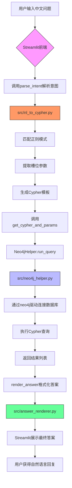

# 技术栈与依赖

<cite>
**本文档中引用的文件**  
- [requirements.txt](file://requirements.txt)
- [src/app.py](file://src/app.py)
- [src/neo4j_helper.py](file://src/neo4j_helper.py)
- [src/nl_to_cypher.py](file://src/nl_to_cypher.py)
- [src/answer_renderer.py](file://src/answer_renderer.py)
</cite>

## 目录
1. [技术栈概述](#技术栈概述)
2. [依赖项详解](#依赖项详解)
3. [技术选型原因](#技术选型原因)
4. [安装与版本兼容性](#安装与版本兼容性)
5. [技术协同工作流程](#技术协同工作流程)
6. [对新手开发者的建议](#对新手开发者的建议)

## 技术栈概述

本项目构建了一个基于知识图谱的智能问答系统，用于查询ACM/ICPC竞赛相关的题目、选手、比赛等信息。系统采用自然语言处理与图数据库查询相结合的方式，用户可通过中文提问，系统自动解析意图并生成Cypher查询语句，从Neo4j图数据库中获取结果并以自然语言形式返回。

核心技术栈包括：
- **Streamlit**：作为Web前端框架，提供交互式用户界面，支持文本输入、按钮操作和结果展示。
- **Neo4j Python驱动**（`neo4j`）：用于连接和查询Neo4j图数据库，执行Cypher语句并返回结构化结果。
- **Python标准库与类型提示**：使用`re`进行正则匹配，`typing`进行类型注解，提升代码可读性和健壮性。

系统整体流程为：用户输入中文问题 → 使用正则表达式解析意图和参数 → 生成Cypher查询模板 → 通过Neo4j驱动执行查询 → 格式化输出结果。

**Section sources**
- [src/app.py](file://src/app.py#L1-L44)
- [src/nl_to_cypher.py](file://src/nl_to_cypher.py#L1-L47)
- [src/neo4j_helper.py](file://src/neo4j_helper.py#L1-L16)
- [src/answer_renderer.py](file://src/answer_renderer.py#L1-L31)

## 依赖项详解

根据`requirements.txt`文件，项目依赖以下两个核心库：

```txt
neo4j==5.9.0
streamlit==1.30.0
```

### Streamlit（版本 1.30.0）

**功能**：Streamlit是一个开源的Python库，专为快速构建数据科学和机器学习应用而设计。它允许开发者通过简单的Python脚本创建交互式Web应用，无需前端开发知识。

在本项目中的作用：
- 创建用户输入框（`st.text_input`）接收中文问题。
- 提供“查询”按钮（`st.button`）触发查询流程。
- 分步展示解析结果、Cypher语句、原始数据和最终答案。
- 使用`st.subheader`、`st.write`、`st.code`、`st.text`等组件美化界面输出。

Streamlit的声明式API使得界面更新与逻辑处理高度集成，极大提升了开发效率。

**Section sources**
- [src/app.py](file://src/app.py#L1-L44)

### Neo4j Python驱动（版本 5.9.0）

**功能**：`neo4j`是Neo4j官方提供的Python驱动程序，支持通过Bolt协议与Neo4j数据库进行高效通信。它提供了会话管理、事务控制、参数化查询等高级功能。

在本项目中的作用：
- 在`Neo4jHelper`类中封装了数据库连接（`GraphDatabase.driver`）和查询执行（`session.run`）逻辑。
- `run_query`方法接收Cypher语句和参数，返回字典列表形式的结果，便于后续处理。
- 支持参数化查询，防止Cypher注入，提升安全性。
- 使用上下文管理器（`with self.driver.session()`）确保资源正确释放。

该驱动是连接应用逻辑与图数据库的核心桥梁。

**Section sources**
- [src/neo4j_helper.py](file://src/neo4j_helper.py#L1-L16)

## 技术选型原因

### 为何选择Streamlit？

- **快速原型开发**：Streamlit允许数据科学家和后端开发者在几分钟内构建出功能完整的Web界面，非常适合课程演示和快速验证想法。
- **简洁的API设计**：无需HTML/CSS/JavaScript知识，纯Python代码即可实现交互逻辑。
- **实时重载**：开发过程中修改代码后浏览器自动刷新，提升开发体验。
- **丰富的组件支持**：支持文本、表格、图表、代码块等多种输出格式，满足多样化展示需求。

### 为何选择Neo4j？

- **图数据模型天然匹配**：ACM/ICPC知识图谱包含题目、标签、选手、题解、比赛等复杂关系，图数据库能高效表达和查询这些关联。
- **强大的Cypher查询语言**：Cypher语法直观，易于编写复杂的多跳查询（如“某作者写过哪些题目的题解”）。
- **高性能关系遍历**：相比传统关系数据库，Neo4j在深度关联查询上性能优势明显。
- **成熟的Python生态**：官方驱动稳定可靠，文档完善，社区活跃。

组合使用Streamlit和Neo4j，实现了从“自然语言输入”到“图数据库查询”再到“自然语言输出”的完整闭环，特别适合知识图谱问答场景。

**Section sources**
- [src/app.py](file://src/app.py#L1-L44)
- [src/neo4j_helper.py](file://src/neo4j_helper.py#L1-L16)
- [src/nl_to_cypher.py](file://src/nl_to_cypher.py#L1-L47)

## 安装与版本兼容性

### 安装命令

```bash
pip install -r requirements.txt
```

该命令将自动安装指定版本的依赖库，确保环境一致性。

### 版本兼容性说明

- **Streamlit 1.30.0**：发布于2023年，属于稳定版本。与Python 3.7–3.11兼容。若使用更高版本的Streamlit，部分API可能发生变化，需注意`st.set_page_config`等函数的参数兼容性。
- **Neo4j 5.9.0**：对应Neo4j服务器5.x系列，使用Bolt协议v4.4。若连接Neo4j 4.x服务器，可能需要降级驱动版本或调整安全配置（如认证方式）。
- **潜在问题**：
  - 若Neo4j服务器未启用Bolt协议或端口未开放（默认7687），连接将失败。
  - 环境变量`NEO_URI`、`NEO_USER`、`NEO_PWD`可用于覆盖默认连接参数，便于部署到不同环境。
  - 建议使用虚拟环境（如`venv`或`conda`）隔离依赖，避免与其他项目冲突。

**Section sources**
- [requirements.txt](file://requirements.txt#L1-L2)
- [src/app.py](file://src/app.py#L10-L13)
- [src/neo4j_helper.py](file://src/neo4j_helper.py#L5-L6)

## 技术协同工作流程

以下流程图展示了各技术组件如何协同完成自然语言到Cypher查询的转换：



**Diagram sources**
- [src/app.py](file://src/app.py#L1-L44)
- [src/nl_to_cypher.py](file://src/nl_to_cypher.py#L1-L47)
- [src/neo4j_helper.py](file://src/neo4j_helper.py#L1-L16)
- [src/answer_renderer.py](file://src/answer_renderer.py#L1-L31)

**Section sources**
- [src/app.py](file://src/app.py#L1-L44)

## 对新手开发者的建议

1. **学习Streamlit**：
   - 官方文档：[https://docs.streamlit.io](https://docs.streamlit.io)
   - 推荐教程：《Streamlit快速入门》——从零开始构建你的第一个数据应用。
   - 实践建议：尝试将简单的Python脚本（如数据分析）包装成Web应用。

2. **掌握Neo4j基础**：
   - 学习Cypher查询语言：[https://neo4j.com/developer/cypher/](https://neo4j.com/developer/cypher/)
   - 安装Neo4j Desktop或使用Neo4j Sandbox免费实例进行练习。
   - 理解图数据库的核心概念：节点、关系、属性、标签。

3. **理解本项目结构**：
   - `nl_to_cypher.py`：通过正则表达式实现自然语言到结构化意图的映射，适合规则明确的场景。
   - `neo4j_helper.py`：封装数据库操作，体现“关注点分离”设计原则。
   - `answer_renderer.py`：根据查询意图定制化输出格式，提升用户体验。

4. **进阶方向**：
   - 使用NLP模型（如BERT）替代正则表达式进行意图识别，提升泛化能力。
   - 添加缓存机制（如Redis）减少重复查询开销。
   - 部署应用到云平台（如Streamlit Community Cloud或Heroku）。

通过本项目，开发者可掌握“前端交互 → 逻辑处理 → 数据库查询 → 结果渲染”的完整流程，为构建更复杂的智能应用打下基础。

**Section sources**
- [src/app.py](file://src/app.py#L1-L44)
- [src/nl_to_cypher.py](file://src/nl_to_cypher.py#L1-L47)
- [src/neo4j_helper.py](file://src/neo4j_helper.py#L1-L16)
- [src/answer_renderer.py](file://src/answer_renderer.py#L1-L31)