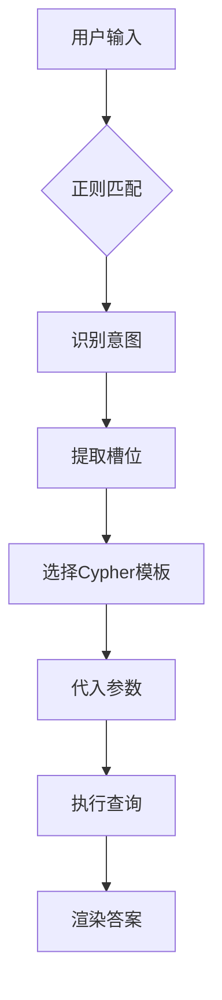

# 查询示例

<cite>
**本文档中引用的文件**  
- [nl_to_cypher.py](file://src/nl_to_cypher.py)
- [answer_renderer.py](file://src/answer_renderer.py)
- [app.py](file://src/app.py)
- [neo4j_helper.py](file://src/neo4j_helper.py)
</cite>

## 目录
1. [简介](#简介)
2. [典型查询示例](#典型查询示例)
   - [1. 查询“难度为困难的题目”](#1-查询难度为困难的题目)
   - [2. 列出所有动态规划相关的题目](#2-列出所有动态规划相关的题目)
   - [3. 2022年全球总决赛冠军团队](#3-2022年全球总决赛冠军团队)
   - [4. 张三写过哪些题解](#4-张三写过哪些题解)
   - [5. 使用Dijkstra算法的题目](#5-使用dijkstra算法的题目)
   - [6. 题目“最短路径”有哪些信息](#6-题目最短路径有哪些信息)
3. [查询解析机制详解](#查询解析机制详解)
4. [当前语言模式的局限性](#当前语言模式的局限性)
5. [用户查询构造建议](#用户查询构造建议)

## 简介

本系统基于知识图谱实现自然语言到Cypher查询的转换，支持对ACM/ICPC竞赛相关数据的智能问答。系统通过正则匹配识别用户意图，生成对应的Cypher语句，从Neo4j图数据库中检索数据，并渲染为可读的中文答案。

系统主要由以下组件构成：
- `nl_to_cypher.py`：负责解析用户输入的自然语言，识别意图并生成Cypher语句。
- `answer_renderer.py`：将数据库返回的结果渲染为结构化的中文答案。
- `neo4j_helper.py`：封装与Neo4j数据库的交互逻辑。
- `app.py`：基于Streamlit的Web界面，集成各组件提供用户交互。

**Section sources**
- [app.py](file://src/app.py#L1-L45)
- [neo4j_helper.py](file://src/neo4j_helper.py#L1-L17)

## 典型查询示例

### 1. 查询“难度为困难的题目”

**用户输入**  
“难度为困难的题目”

**系统解析**  
- **意图类型**：`get_problem_difficulty`
- **槽位参数**：`{"problem": "困难"}`

**生成的Cypher语句**  
```cypher
MATCH (p:Problem) WHERE toLower(p.name) CONTAINS toLower($problem) RETURN p.name AS name, p.rating AS rating LIMIT 10
```

**数据库返回的部分数据**  
```json
[
  {"name": "最长公共子序列", "rating": "困难"},
  {"name": "编辑距离", "rating": "困难"}
]
```

**最终渲染的中文答案**  
```
题目：最长公共子序列 — 难度：困难
题目：编辑距离 — 难度：困难
```

**Section sources**
- [nl_to_cypher.py](file://src/nl_to_cypher.py#L10-L11)
- [answer_renderer.py](file://src/answer_renderer.py#L7-L9)

### 2. 列出所有动态规划相关的题目

**用户输入**  
“列出所有动态规划相关的题目”

**系统解析**  
- **意图类型**：`list_problems_by_tag`
- **槽位参数**：`{"tag": "动态规划"}`

**生成的Cypher语句**  
```cypher
MATCH (p:Problem)-[:HAS_TAG]->(t:Tag) WHERE toLower(t.name)=toLower($tag) RETURN p.name AS name, p.rating AS rating LIMIT 100
```

**数据库返回的部分数据**  
```json
[
  {"name": "背包问题", "rating": "中等"},
  {"name": "最长递增子序列", "rating": "困难"}
]
```

**最终渲染的中文答案**  
```
匹配题目：
- 背包问题（难度：中等）
- 最长递增子序列（难度：困难）
```

**Section sources**
- [nl_to_cypher.py](file://src/nl_to_cypher.py#L12-L13)
- [answer_renderer.py](file://src/answer_renderer.py#L15-L17)

### 3. 2022年全球总决赛冠军团队

**用户输入**  
“2022年全球总决赛冠军团队”

**系统解析**  
- **意图类型**：`get_contest_winner`
- **槽位参数**：`{"year_or_name": "2022年全球总决赛"}`

**生成的Cypher语句**  
```cypher
MATCH (tm:Team)-[r:PLACED]->(c:Contest) WHERE toLower(c.name) CONTAINS toLower($year_or_name) AND r.rank IN ['1','1st','冠军'] RETURN tm.name AS team, r.rank AS rank, r.region AS region LIMIT 5
```

**数据库返回的部分数据**  
```json
[
  {"team": "Tsinghua University", "rank": "冠军", "region": "Asia"}
]
```

**最终渲染的中文答案**  
```
冠军/第一名：
Tsinghua University（地区：Asia，名次：冠军）
```

**Section sources**
- [nl_to_cypher.py](file://src/nl_to_cypher.py#L14-L15)
- [answer_renderer.py](file://src/answer_renderer.py#L18-L20)

### 4. 张三写过哪些题解

**用户输入**  
“张三写过哪些题解”

**系统解析**  
- **意图类型**：`get_solutions_by_author`
- **槽位参数**：`{"author": "张三"}`

**生成的Cypher语句**  
```cypher
MATCH (pr:Person {name:$author})<-[:AUTHOR]-(s:Solution)<-[:HAS_SOLUTION]-(p:Problem) RETURN p.name AS problem, s.id AS sid, substring(s.content,0,300) AS snippet LIMIT 50
```

**数据库返回的部分数据**  
```json
[
  {"problem": "两数之和", "sid": "sol_001", "snippet": "这是一个简单的哈希表应用..."}
]
```

**最终渲染的中文答案**  
```
该作者的题解：
两数之和 — solution id: sol_001
摘要: 这是一个简单的哈希表应用...
```

**Section sources**
- [nl_to_cypher.py](file://src/nl_to_cypher.py#L16-L17)
- [answer_renderer.py](file://src/answer_renderer.py#L21-L24)

### 5. 使用Dijkstra算法的题目

**用户输入**  
“使用Dijkstra算法的题目”

**系统解析**  
- **意图类型**：`find_problems_using_algorithm`
- **槽位参数**：`{"algo": "Dijkstra"}`

**生成的Cypher语句**  
```cypher
MATCH (p:Problem)-[:HAS_TAG]->(t:Tag) WHERE toLower(t.name) CONTAINS toLower($algo) RETURN p.name AS name, p.rating AS rating LIMIT 100
```

**数据库返回的部分数据**  
```json
[
  {"name": "最短路径问题", "rating": "中等"}
]
```

**最终渲染的中文答案**  
```
匹配题目：
- 最短路径问题（难度：中等）
```

**Section sources**
- [nl_to_cypher.py](file://src/nl_to_cypher.py#L18-L19)
- [answer_renderer.py](file://src/answer_renderer.py#L15-L17)

### 6. 题目“最短路径”有哪些信息

**用户输入**  
“题目“最短路径”有哪些信息”

**系统解析**  
- **意图类型**：`get_problem_info`
- **槽位参数**：`{"problem": "最短路径"}`

**生成的Cypher语句**  
```cypher
MATCH (p:Problem) WHERE toLower(p.name) CONTAINS toLower($problem) OPTIONAL MATCH (p)-[:HAS_TAG]->(t:Tag) OPTIONAL MATCH (p)-[:HAS_SOLUTION]->(s:Solution) RETURN p.name AS name, p.rating AS rating, collect(distinct t.name) AS tags, collect(distinct s.id) AS solutions LIMIT 5
```

**数据库返回的部分数据**  
```json
[
  {
    "name": "最短路径问题",
    "rating": "中等",
    "tags": ["图论", "Dijkstra"],
    "solutions": ["sol_002"]
  }
]
```

**最终渲染的中文答案**  
```
题目：最短路径问题
难度：中等
标签：图论, Dijkstra
题解IDs：sol_002
```

**Section sources**
- [nl_to_cypher.py](file://src/nl_to_cypher.py#L20-L21)
- [answer_renderer.py](file://src/answer_renderer.py#L10-L14)

## 查询解析机制详解

系统通过正则表达式匹配用户输入，识别预定义的意图类型，并提取关键参数（槽位）。每种意图对应一个Cypher模板，系统将提取的参数代入模板生成可执行的Cypher语句。

### 正则匹配逻辑

| 意图类型 | 正则模式 | 匹配关键词 |
|---------|---------|---------|
| `get_problem_difficulty` | `(?:题目|problem)\s*[\"“']?([^\"”']+)[\"”']?\s*(?:的)?\s*(?:难度|rating)` | 题目、难度 |
| `list_problems_by_tag` | `(?:有哪些|列出|给我).*?(?:关于|涉及|含有)\s*([^\s，。]+)` | 有哪些、关于 |
| `get_contest_winner` | `(?:谁是|冠军|第一名).*(\d{4}|20\d{2}|[^\s，。]+赛)` | 谁是、冠军 |
| `get_solutions_by_author` | `(?:作者|由)\s*([^\s，。]+)` | 作者、由 |
| `find_problems_using_algorithm` | `(?:使用|用到|涉及)\s*([^\s，。]+)\s*(?:算法)?` | 使用、算法 |
| `get_problem_info` | `(?:题目|problem)\s*[\"“']?([^\"”']+)[\"”']?\s*(?:的)?\s*(?:信息|详情|是什么)?` | 题目、信息 |

### Cypher模板结构

Cypher模板使用参数化查询，确保安全性并提高查询效率。模板中使用`$parameter`占位符，系统在运行时将槽位参数代入。



**Diagram sources**
- [nl_to_cypher.py](file://src/nl_to_cypher.py#L10-L21)
- [answer_renderer.py](file://src/answer_renderer.py#L7-L24)

**Section sources**
- [nl_to_cypher.py](file://src/nl_to_cypher.py#L10-L21)
- [answer_renderer.py](file://src/answer_renderer.py#L7-L24)

## 当前语言模式的局限性

当前系统存在以下局限性：

1. **不支持复杂嵌套问题**：系统无法处理包含多个子问题的复合查询，例如“列出所有动态规划相关的题目，并显示它们的难度”。
2. **模糊语义识别能力有限**：系统依赖精确的关键词匹配，无法理解同义词或近义词。例如，“DP”无法识别为“动态规划”。
3. **上下文感知能力缺失**：系统无法利用对话历史进行上下文推理，每次查询都是独立的。
4. **正则表达式覆盖范围有限**：新类型的查询需要手动添加正则模式和Cypher模板。

## 用户查询构造建议

为确保查询被正确识别，建议用户参照以下模式构造查询：

- **使用明确的关键词**：如“题目”、“难度”、“作者”、“使用”等。
- **避免模糊表达**：尽量使用系统支持的关键词，避免使用同义词或口语化表达。
- **简化查询结构**：避免在一个查询中包含多个问题，应拆分为多个独立查询。
- **参考示例问题**：使用文档中提供的示例问题作为模板，替换其中的关键参数。

通过遵循这些模式，用户可以更有效地与系统交互，获得准确的查询结果。