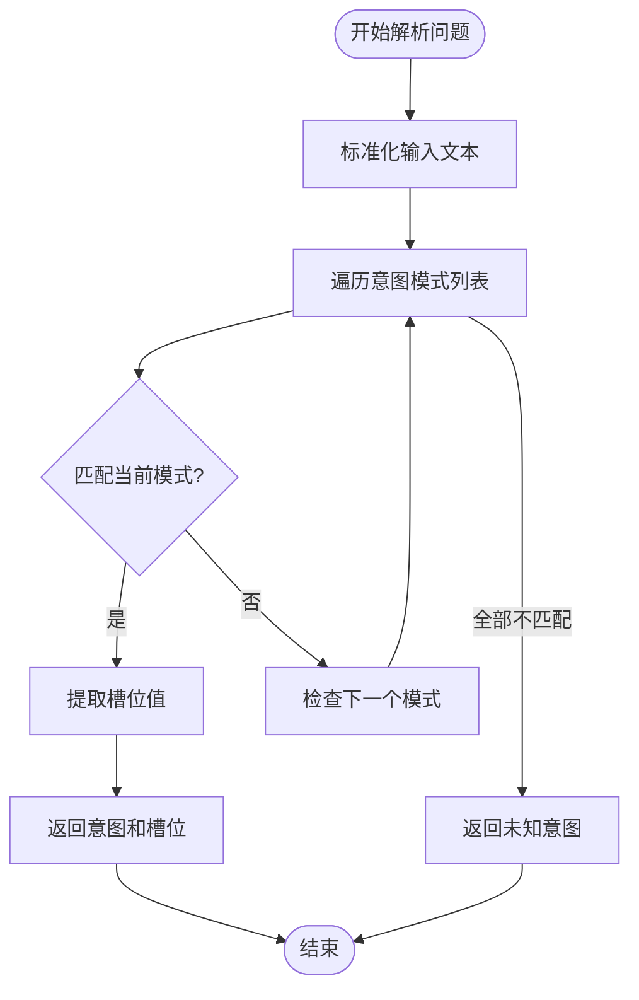
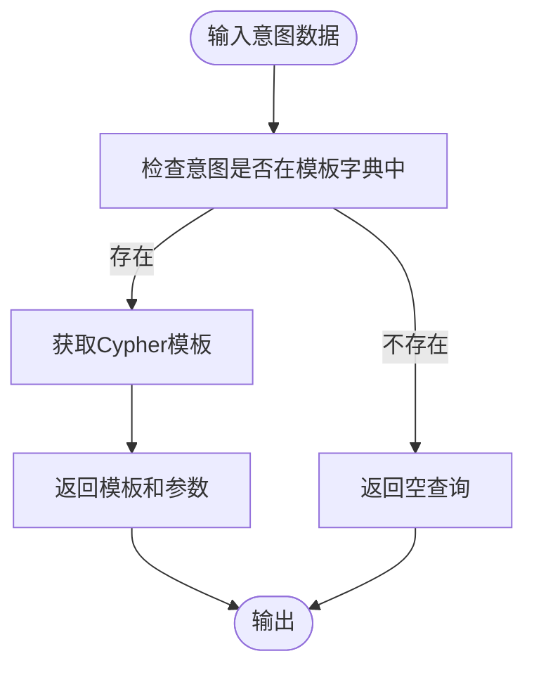
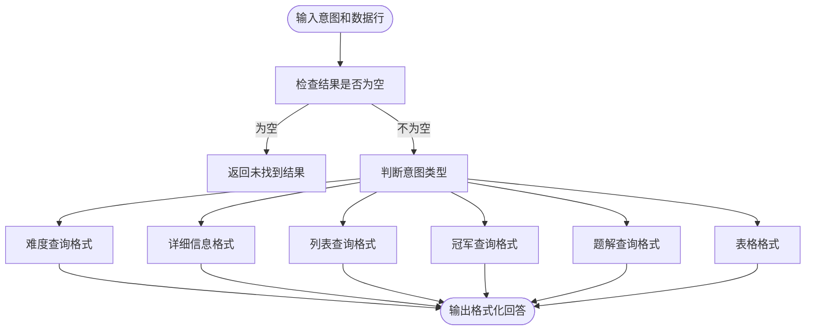
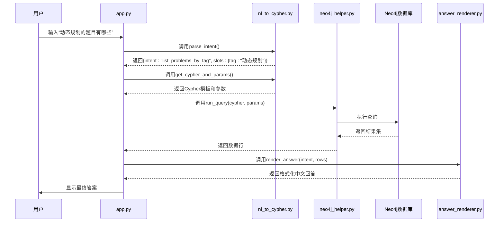

# 核心功能说明

<cite>
**Referenced Files in This Document**   
- [nl_to_cypher.py](file://src/nl_to_cypher.py)
- [answer_renderer.py](file://src/answer_renderer.py)
- [app.py](file://src/app.py)
- [neo4j_helper.py](file://src/neo4j_helper.py)
</cite>

## 目录
1. [系统概述](#系统概述)
2. [意图识别与Cypher生成](#意图识别与cypher生成)
3. [答案渲染机制](#答案渲染机制)
4. [完整查询处理流程](#完整查询处理流程)
5. [错误处理机制](#错误处理机制)

## 系统概述

本系统实现了将中文自然语言问题转化为知识图谱查询并返回可读答案的完整流程。系统由四个核心模块构成：`nl_to_cypher.py`负责意图识别和Cypher查询生成，`answer_renderer.py`负责将数据库结果格式化为中文回答，`neo4j_helper.py`提供与Neo4j数据库的交互接口，`app.py`作为主应用协调各模块工作。

**Section sources**
- [app.py](file://src/app.py#L1-L45)

## 意图识别与Cypher生成

系统通过基于正则表达式的模式匹配机制实现意图识别。`nl_to_cypher.py`文件中定义了`INTENT_PATTERNS`列表，包含六种预定义的查询意图及其对应的正则表达式模式。

### 支持的查询类型

系统支持以下六种核心查询类型：

1. **题目难度查询**：识别如“题目‘两数之和’的难度”这类问题
2. **按标签列出题目**：识别如“有哪些关于动态规划的题目”这类问题
3. **查询比赛冠军**：识别如“2020年ICPC冠军是谁”这类问题
4. **查找作者题解**：识别如“作者张三的题解”这类问题
5. **查找使用特定算法的题目**：识别如“使用Dijkstra算法的题目”这类问题
6. **题目详细信息查询**：识别如“题目‘最长公共子序列’的信息”这类问题

### 意图识别机制

`parse_intent`函数是意图识别的核心。该函数接收用户输入的中文问题，依次尝试匹配`INTENT_PATTERNS`中的每个正则表达式。一旦匹配成功，即提取出对应的意图名称和槽位值（实体信息），并返回包含意图和槽位的字典。

**Diagram sources**
- [nl_to_cypher.py](file://src/nl_to_cypher.py#L29-L39)

**Section sources**
- [nl_to_cypher.py](file://src/nl_to_cypher.py#L1-L47)

### Cypher查询生成

`get_cypher_and_params`函数根据识别出的意图，从`CYPHER_TEMPLATES`字典中查找对应的Cypher查询模板，并将提取的槽位值作为参数返回。Cypher查询使用`toLower()`函数进行不区分大小写的匹配，确保查询的鲁棒性。

**Diagram sources**
- [nl_to_cypher.py](file://src/nl_to_cypher.py#L41-L46)

## 答案渲染机制

`answer_renderer.py`模块中的`render_answer`函数负责将数据库返回的原始数据转换为用户友好的中文回答。该函数根据不同的意图类型，采用不同的格式化策略。

### 不同意图的答案格式

- **题目难度查询**：显示题目名称和对应难度
- **题目详细信息查询**：显示题目名称、难度、标签列表和题解ID
- **按标签/算法查询**：以列表形式显示匹配的题目及其难度
- **比赛冠军查询**：显示冠军队伍、地区和名次信息
- **作者题解查询**：显示题目、题解ID和内容摘要

**Diagram sources**
- [answer_renderer.py](file://src/answer_renderer.py#L3-L30)

**Section sources**
- [answer_renderer.py](file://src/answer_renderer.py#L1-L31)

## 完整查询处理流程

系统处理一个典型查询（如“动态规划的题目有哪些”）的完整路径如下：

**Diagram sources**
- [app.py](file://src/app.py#L1-L45)
- [nl_to_cypher.py](file://src/nl_to_cypher.py#L1-L47)
- [neo4j_helper.py](file://src/neo4j_helper.py#L1-L16)
- [answer_renderer.py](file://src/answer_renderer.py#L1-L31)

**Section sources**
- [app.py](file://src/app.py#L1-L45)

## 错误处理机制

系统实现了多层次的错误处理机制：

1. **意图识别失败**：当`parse_intent`无法匹配任何预定义模式时，返回`unknown`意图。主应用检测到此情况后，会向用户显示“未识别意图，请换种表述或使用示例问题”的警告。

2. **数据库查询异常**：`app.py`中的查询逻辑被包裹在`try-except`块中。如果`neo4j_helper.py`在执行查询时抛出异常（如连接失败、语法错误等），系统会捕获该异常并向用户显示具体的错误信息。

3. **空结果处理**：`render_answer`函数首先检查结果集是否为空，若为空则返回“抱歉，未找到匹配的结果”的友好提示，而不是显示空数据。

**Section sources**
- [app.py](file://src/app.py#L30-L44)