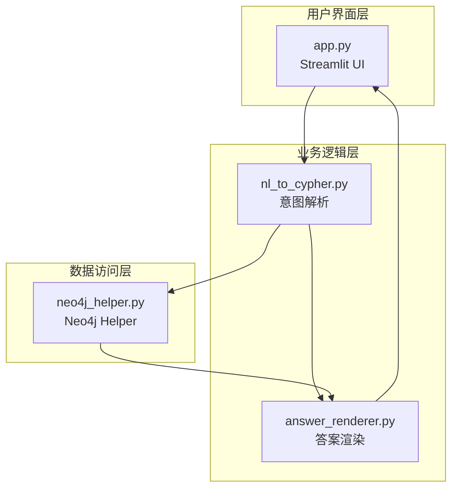
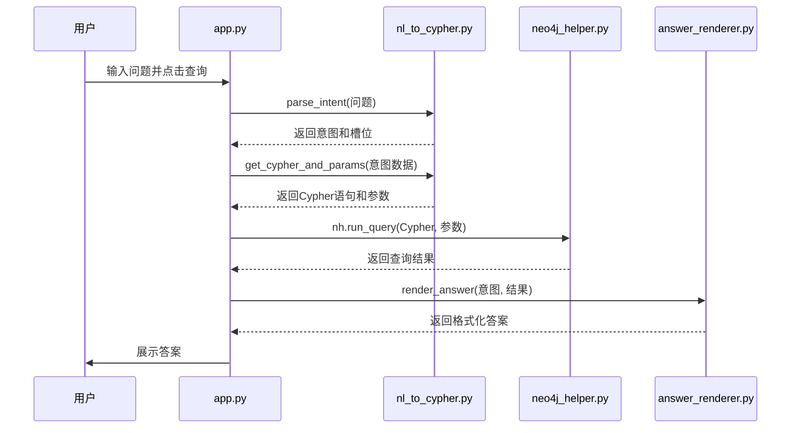
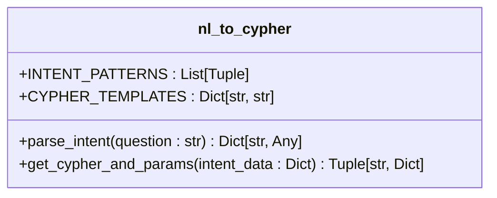
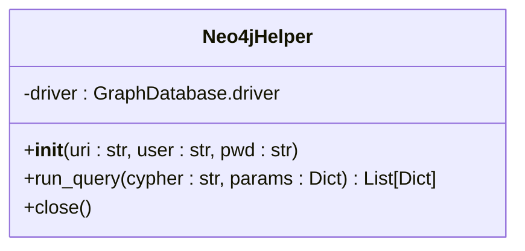
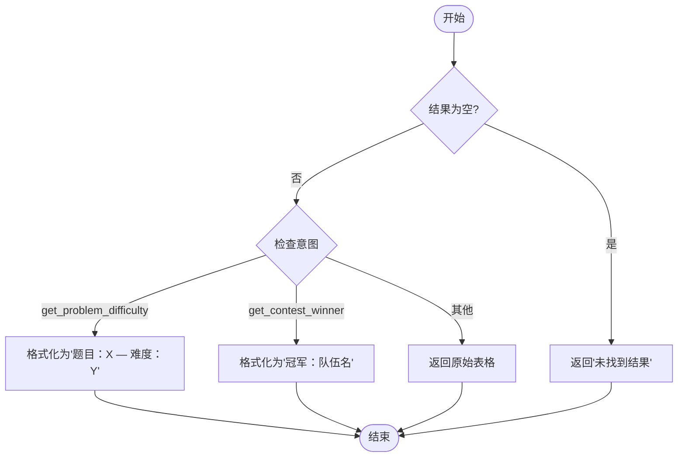
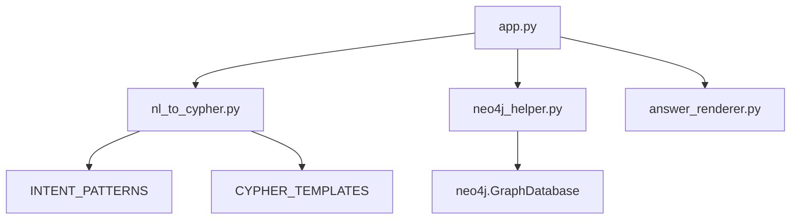

# 项目概述

<cite>
**Referenced Files in This Document**   
- [app.py](file://src/app.py)
- [nl_to_cypher.py](file://src/nl_to_cypher.py)
- [neo4j_helper.py](file://src/neo4j_helper.py)
- [answer_renderer.py](file://src/answer_renderer.py)
</cite>

## 目录
1. [简介](#简介)
2. [项目结构](#项目结构)
3. [核心组件](#核心组件)
4. [架构概览](#架构概览)
5. [详细组件分析](#详细组件分析)
6. [依赖分析](#依赖分析)
7. [性能考量](#性能考量)
8. [故障排除指南](#故障排除指南)
9. [结论](#结论)

## 简介

ACM-ICPC知识图谱问答系统是一个基于自然语言处理的智能查询工具，旨在帮助用户通过中文问题快速检索Neo4j图数据库中存储的ACM/ICPC竞赛相关信息。该系统允许用户以自然语言形式提问，例如“题目‘Two Sum’的难度是多少？”或“谁是2020年ICPC世界总决赛的冠军？”，系统将自动解析问题意图，生成对应的Cypher查询语句，在图数据库中执行并返回结构化结果，最终以用户友好的格式呈现答案。本系统采用MVC（模型-视图-控制器）设计模式，各模块职责清晰，便于维护和扩展。

## 项目结构

项目采用模块化设计，主要由四个核心Python文件构成，分别承担不同的职责：
- `app.py`：用户界面层，使用Streamlit框架构建交互式Web界面。
- `nl_to_cypher.py`：意图解析模块，负责将自然语言问题转换为结构化的查询意图和参数。
- `neo4j_helper.py`：数据访问层，封装了与Neo4j图数据库的连接和查询操作。
- `answer_renderer.py`：答案渲染模块，根据查询意图和结果数据生成自然语言形式的答案。

**Section sources**
- [app.py](file://src/app.py#L1-L45)
- [nl_to_cypher.py](file://src/nl_to_cypher.py#L1-L48)
- [neo4j_helper.py](file://src/neo4j_helper.py#L1-L17)
- [answer_renderer.py](file://src/answer_renderer.py#L1-L32)

## 核心组件

系统的核心功能由四个主要组件协同完成。用户通过`app.py`提供的Streamlit界面输入问题，该问题被传递给`nl_to_cypher.py`进行意图识别和槽位提取。解析出的意图和参数被用于从预定义的模板中获取相应的Cypher查询语句。随后，`neo4j_helper.py`负责连接Neo4j数据库并执行该Cypher查询。最后，查询返回的原始数据被传递给`answer_renderer.py`，由其根据不同的意图类型格式化并生成最终的自然语言答案。

**Section sources**
- [app.py](file://src/app.py#L1-L45)
- [nl_to_cypher.py](file://src/nl_to_cypher.py#L1-L48)
- [neo4j_helper.py](file://src/neo4j_helper.py#L1-L17)
- [answer_renderer.py](file://src/answer_renderer.py#L1-L32)

## 架构概览

该系统遵循清晰的MVC架构模式，实现了关注点分离。用户界面（View）由Streamlit驱动，负责展示和输入。业务逻辑（Controller）主要体现在`nl_to_cypher.py`和`answer_renderer.py`中，它们处理输入、转换数据并决定如何响应。数据访问（Model）则由`neo4j_helper.py`实现，直接与Neo4j数据库交互。

**Diagram sources**
- [app.py](file://src/app.py#L1-L45)
- [nl_to_cypher.py](file://src/nl_to_cypher.py#L1-L48)
- [neo4j_helper.py](file://src/neo4j_helper.py#L1-L17)
- [answer_renderer.py](file://src/answer_renderer.py#L1-L32)

## 详细组件分析

### 用户界面层 (app.py) 分析

`app.py`是整个系统的入口和用户交互中心。它利用Streamlit框架创建了一个简洁的Web应用，包含一个文本输入框供用户输入中文问题，以及一个“查询”按钮来触发处理流程。当用户提交问题后，该模块会依次调用其他组件的API：首先调用`parse_intent`函数解析问题，然后调用`get_cypher_and_params`生成查询语句，接着通过`Neo4jHelper`实例执行数据库查询，最后使用`render_answer`函数将结果渲染成文本并展示给用户。此外，为了便于调试，该模块还会在界面上显示解析出的意图、槽位信息以及生成的Cypher语句。

**Diagram sources**
- [app.py](file://src/app.py#L1-L45)
- [nl_to_cypher.py](file://src/nl_to_cypher.py#L29-L46)
- [neo4j_helper.py](file://src/neo4j_helper.py#L8-L12)
- [answer_renderer.py](file://src/answer_renderer.py#L3-L30)

**Section sources**
- [app.py](file://src/app.py#L1-L45)

### 意图解析模块 (nl_to_cypher.py) 分析

`nl_to_cypher.py`模块是系统实现自然语言理解的关键。它采用基于规则的正则表达式匹配方法来识别用户的查询意图。模块内部定义了两个核心数据结构：`INTENT_PATTERNS`和`CYPHER_TEMPLATES`。`INTENT_PATTERNS`是一个元组列表，每个元组包含一个意图名称、一个用于匹配该意图的正则表达式以及需要提取的槽位名称。`parse_intent`函数会遍历这些模式，一旦发现匹配，就提取出相关的槽位信息（如题目名、作者名等），并返回一个包含意图和槽位的字典。`get_cypher_and_params`函数则根据解析出的意图，从`CYPHER_TEMPLATES`字典中查找并返回对应的Cypher查询模板和参数。

**Diagram sources**
- [nl_to_cypher.py](file://src/nl_to_cypher.py#L4-L27)
- [nl_to_cypher.py](file://src/nl_to_cypher.py#L14-L27)
- [nl_to_cypher.py](file://src/nl_to_cypher.py#L29-L46)

**Section sources**
- [nl_to_cypher.py](file://src/nl_to_cypher.py#L1-L48)

### 数据访问层 (neo4j_helper.py) 分析

`neo4j_helper.py`模块封装了所有与Neo4j数据库的交互逻辑，实现了数据访问的抽象。它定义了一个`Neo4jHelper`类，该类在初始化时建立与数据库的连接。核心方法`run_query`接受一个Cypher查询字符串和一个参数字典，然后在数据库会话中执行该查询，并将结果集转换为Python字典列表返回。这种设计使得上层应用无需关心底层数据库连接和结果处理的细节，只需专注于业务逻辑。

**Diagram sources**
- [neo4j_helper.py](file://src/neo4j_helper.py#L4-L15)

**Section sources**
- [neo4j_helper.py](file://src/neo4j_helper.py#L1-L17)

### 答案渲染模块 (answer_renderer.py) 分析

`answer_renderer.py`模块负责将数据库返回的原始数据转换为易于理解的自然语言文本。`render_answer`函数根据传入的意图类型，采用不同的模板来格式化结果。例如，对于查询题目难度的意图，它会生成一个包含题目名和难度的列表；对于查询比赛冠军的意图，它会列出冠军队伍及其信息。如果查询结果为空，它会返回一个友好的提示信息。该模块确保了最终呈现给用户的信息是清晰和人性化的。

**Diagram sources**
- [answer_renderer.py](file://src/answer_renderer.py#L3-L30)

**Section sources**
- [answer_renderer.py](file://src/answer_renderer.py#L1-L32)

## 依赖分析

系统各模块之间存在明确的依赖关系。`app.py`作为主控模块，直接依赖于`nl_to_cypher.py`、`neo4j_helper.py`和`answer_renderer.py`中的函数和类。`nl_to_cypher.py`模块内部依赖其定义的`INTENT_PATTERNS`和`CYPHER_TEMPLATES`常量。`neo4j_helper.py`依赖于外部的`neo4j` Python驱动包来建立数据库连接。`answer_renderer.py`则是一个独立的纯逻辑模块，不依赖其他自定义模块。这种依赖结构保证了系统的模块化和低耦合。

**Diagram sources**
- [app.py](file://src/app.py#L1-L45)
- [nl_to_cypher.py](file://src/nl_to_cypher.py#L4-L27)
- [nl_to_cypher.py](file://src/nl_to_cypher.py#L14-L27)
- [neo4j_helper.py](file://src/neo4j_helper.py#L1-L17)

**Section sources**
- [app.py](file://src/app.py#L1-L45)
- [nl_to_cypher.py](file://src/nl_to_cypher.py#L1-L48)
- [neo4j_helper.py](file://src/neo4j_helper.py#L1-L17)

## 性能考量

系统的性能主要受Neo4j数据库查询效率的影响。`nl_to_cypher.py`中定义的Cypher查询语句均使用了`LIMIT`子句来限制返回结果的数量，这有助于防止因返回大量数据而导致的性能瓶颈和内存溢出。此外，`app.py`在展示原始结果时也只显示前50条，进一步保证了前端的响应速度。数据库层面的性能优化，如为`Problem.name`、`Tag.name`等常用查询字段建立索引，对于提升整体查询速度至关重要。

## 故障排除指南

当系统无法正常工作时，可以按照以下步骤进行排查：
1.  **检查数据库连接**：确认Neo4j服务正在运行，并且`app.py`中的`NEO_URI`、`NEO_USER`和`NEO_PWD`配置正确。
2.  **验证意图识别**：在界面上输入问题后，检查“解析结果”部分。如果意图为“unknown”，说明问题的表述方式未能匹配`nl_to_cypher.py`中定义的任何正则模式，需要调整问题或扩展模式库。
3.  **检查Cypher语句**：查看“执行 Cypher”部分显示的语句是否正确，参数是否已填充。可以在Neo4j Browser中手动执行该语句以验证其有效性。
4.  **查看错误信息**：如果查询出错，`app.py`会捕获异常并在界面上显示错误信息，这通常是定位问题的关键。

**Section sources**
- [app.py](file://src/app.py#L1-L45)
- [nl_to_cypher.py](file://src/nl_to_cypher.py#L1-L48)

## 结论

ACM-ICPC知识图谱问答系统成功地将自然语言查询与图数据库技术相结合，为用户提供了一种便捷的信息检索方式。通过清晰的MVC架构和模块化设计，系统实现了从用户输入到答案输出的完整闭环。尽管当前的意图识别基于规则，但其设计为未来集成更先进的机器学习模型奠定了良好的基础。该系统不仅是一个实用的工具，也是一个理解自然语言处理、图数据库和Web应用集成的优秀教学案例。