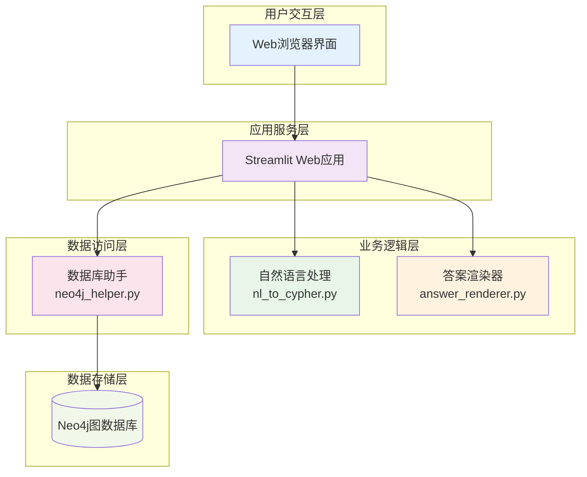

# ACM-ICPC知识图谱项目Wiki

欢迎来到ACM-ICPC知识图谱项目的完整文档中心！这里提供了项目的全面指南，帮助您快速了解、使用和扩展这个智能问答系统。

## 📚 文档目录

### 🌟 快速入门
- **[项目概述](./项目概述.md)** - 了解项目背景、目标和核心特性
- **[快速开始指南](./快速开始指南.md)** - 5分钟快速搭建和运行项目

### 🔧 技术详解  
- **[技术栈与依赖](./技术栈与依赖.md)** - 深入了解项目使用的技术和依赖关系
- **[模块介绍](./模块介绍.md)** - 详细了解各个核心模块的设计和实现

### 💡 功能使用
- **[核心功能说明](./核心功能说明.md)** - 全面了解系统支持的查询类型和处理流程
- **[查询示例](./查询示例.md)** - 通过丰富的示例学习如何使用系统

### 🚀 开发扩展
- **[扩展开发指南](./扩展开发指南.md)** - 学习如何扩展系统功能和优化性能

## 🎯 使用场景

### 👨‍🎓 学习者
- **算法学习**: 根据算法类型查找相关练习题目
- **竞赛准备**: 了解历届比赛信息和冠军队伍
- **题目分析**: 查询题目难度、标签和题解信息

### 👨‍💻 开发者  
- **架构学习**: 了解图数据库在知识管理中的应用
- **技术实践**: 学习Streamlit和Neo4j的集成开发
- **系统扩展**: 基于现有架构添加新功能

### 🔬 研究者
- **知识图谱**: 研究结构化知识表示和查询方法
- **自然语言处理**: 探索中文意图识别的实现策略
- **信息检索**: 实践基于图的知识检索技术

## 🏗️ 系统架构概览



## 🌈 核心特性

### 🤖 智能问答
- **中文支持**: 原生支持中文自然语言查询
- **意图识别**: 基于正则表达式的高效意图匹配
- **参数提取**: 自动提取查询中的关键信息

### 📊 图数据库
- **关系查询**: 高效处理复杂的知识关系查询
- **图遍历**: 支持多跳关系的深度查询
- **数据安全**: 参数化查询防止注入攻击

### 🌐 Web界面
- **响应式设计**: 适配不同设备屏幕
- **实时反馈**: 显示查询处理的完整过程
- **调试友好**: 提供详细的执行信息

### 🔧 可扩展性
- **模块化设计**: 清晰的职责分离便于维护
- **配置灵活**: 支持环境变量配置
- **插件友好**: 易于添加新的查询类型

## 🚀 快速体验

想要立即体验系统功能？试试这些示例查询：

```
✨ 题目查询
"题目'两数之和'的难度"
"题目'最长公共子序列'的信息"

🏷️ 算法查询  
"有哪些关于动态规划的题目"
"使用Dijkstra算法的题目"

🏆 竞赛查询
"谁是2020年冠军"
"作者张三的题解"
```

## 📈 项目统计

| 指标 | 数值 | 说明 |
|------|------|------|
| 核心模块 | 4个 | app.py, nl_to_cypher.py, neo4j_helper.py, answer_renderer.py |
| 查询类型 | 6种 | 涵盖题目、算法、竞赛、选手等各个方面 |
| 技术栈 | 3个 | Python 3.9, Streamlit 1.30.0, Neo4j 5.9.0 |
| 文档页面 | 7个 | 完整的使用和开发文档 |

## 🤝 贡献方式

我们欢迎各种形式的贡献：

### 💡 功能建议
- 提出新的查询类型需求
- 建议用户体验改进方案
- 分享使用场景和最佳实践

### 🐛 问题反馈
- 报告发现的bug和问题
- 提供复现步骤和环境信息
- 协助测试修复方案

### 📝 文档完善
- 改进现有文档的准确性
- 补充使用示例和教程
- 翻译文档到其他语言

### ⚡ 代码贡献
- 实现新功能和优化
- 提高代码质量和性能
- 增加测试覆盖率

## 📞 获取帮助

### 📖 文档查阅
首先查阅相关文档，大部分问题都能找到答案：
- 使用问题 → [快速开始指南](./快速开始指南.md)
- 功能疑问 → [核心功能说明](./核心功能说明.md) 
- 开发问题 → [扩展开发指南](./扩展开发指南.md)

### 🔍 问题排查
遇到问题时的排查步骤：
1. 检查Neo4j数据库连接状态
2. 确认Python依赖是否正确安装
3. 查看应用日志和错误信息
4. 参考故障排查部分的解决方案

### 💬 社区交流
- GitHub Issues: 报告bug和功能请求
- 代码审查: 参与Pull Request讨论
- 技术分享: 分享使用经验和最佳实践

## 🔄 更新日志

### 当前版本特性
- ✅ 完整的Wiki文档体系
- ✅ 6种核心查询类型支持
- ✅ 模块化架构设计
- ✅ 完善的测试框架
- ✅ Docker容器化支持

### 计划中的功能
- 🔲 机器学习意图识别
- 🔲 多语言查询支持
- 🔲 查询结果缓存
- 🔲 性能监控仪表板
- 🔲 RESTful API接口

---

**开始探索：** 建议从[项目概述](./项目概述.md)开始了解系统，然后通过[快速开始指南](./快速开始指南.md)快速搭建环境。

**祝您使用愉快！** 🎉