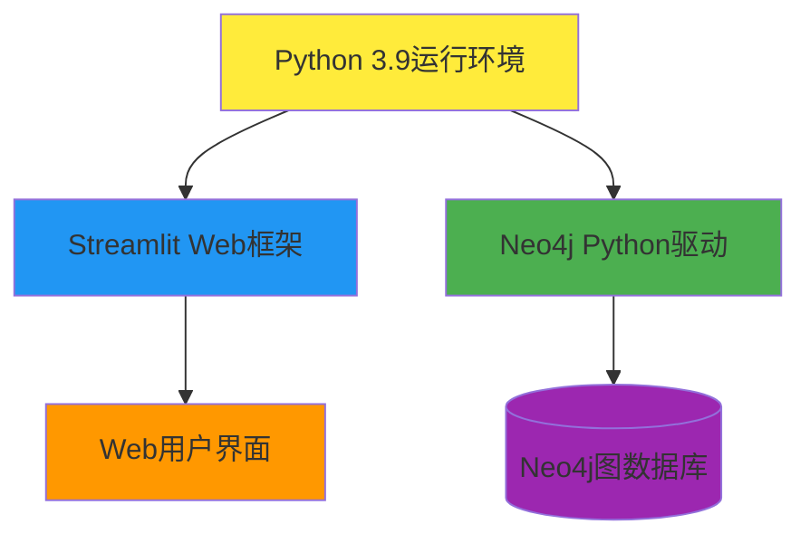

# 技术栈与依赖

## 核心技术选型

### 🐍 Python 3.9 - 运行环境
- **版本**: Python 3.9
- **路径**: `c:\users\11205\appdata\local\programs\python\python39\`
- **选择理由**: 稳定性强，生态丰富，与框架兼容性好

### 🌐 Streamlit 1.30.0 - Web框架
- **功能**: 快速构建交互式Web应用
- **特点**: 纯Python开发，声明式API，实时交互
- **应用**: 用户界面、数据展示、表单交互

### 🗂️ Neo4j 5.9.0 - 图数据库
- **驱动**: neo4j Python驱动
- **功能**: 图数据存储、Cypher查询、关系遍历
- **配置**: 支持环境变量配置连接参数

## 依赖管理

### requirements.txt
```
neo4j==5.9.0
streamlit==1.30.0
```

### 安装方式
```bash
pip install -r requirements.txt
```

## 技术架构



## 环境配置

### Neo4j连接配置
| 环境变量 | 默认值 | 说明 |
|---------|--------|------|
| NEO_URI | bolt://localhost:7687 | 数据库连接URI |
| NEO_USER | neo4j | 数据库用户名 |
| NEO_PWD | luogu20201208 | 数据库密码 |

### 运行要求
- Python 3.9或更高版本
- Neo4j数据库服务
- 网络连接（本地或远程数据库）

## 技术特点

### 🚀 开发效率
- **快速原型**: Streamlit支持快速Web应用开发
- **简单部署**: 单命令启动应用服务
- **热重载**: 代码变更自动刷新界面

### 🔧 可维护性
- **模块化**: 清晰的模块分离和职责划分
- **配置化**: 通过环境变量灵活配置
- **标准化**: 遵循Python开发最佳实践

### 📈 扩展性
- **插件系统**: 易于添加新的查询类型
- **组件复用**: 模块化设计支持组件复用
- **数据源**: 支持扩展到其他图数据库

## 性能考量

### 查询优化
- 参数化查询防止注入攻击
- 合理的查询结果限制
- 连接池管理优化

### 资源管理
- 自动连接管理和释放
- 会话生命周期控制
- 异常处理和恢复机制