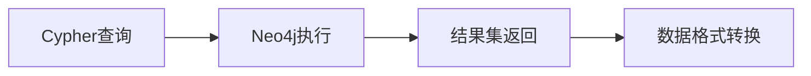

# 核心功能说明

## 功能概览

ACM-ICPC知识图谱系统提供基于自然语言的智能问答功能，支持多种类型的竞赛知识查询。

## 支持的查询类型

### 📊 题目相关查询

#### 1. 题目难度查询
**功能描述**: 根据题目名称查询其难度评级
**查询示例**: 
- "题目'两数之和'的难度"
- "problem '最长公共子序列' 的 rating"

**返回信息**:
- 题目名称
- 难度评级(rating)

#### 2. 题目详细信息查询
**功能描述**: 获取题目的完整信息
**查询示例**:
- "题目'最长公共子序列'的信息"
- "problem 'Knapsack' 详情"

**返回信息**:
- 题目名称和难度
- 相关标签列表
- 题解ID列表

### 🏷️ 标签与算法查询

#### 3. 按标签查询题目
**功能描述**: 根据算法标签或主题查找相关题目
**查询示例**:
- "有哪些关于动态规划的题目"
- "列出涉及贪心算法的问题"

**返回信息**:
- 题目名称列表
- 对应难度评级

#### 4. 算法相关题目查询
**功能描述**: 查找使用特定算法的题目
**查询示例**:
- "使用Dijkstra算法的题目"
- "涉及KMP算法的problem"

**返回信息**:
- 相关题目名称
- 题目难度等级

### 🏆 竞赛与选手查询

#### 5. 竞赛冠军查询
**功能描述**: 查询特定年份或比赛的冠军信息
**查询示例**:
- "谁是2020年冠军"
- "ICPC World Finals 第一名"

**返回信息**:
- 冠军队伍名称
- 比赛地区信息
- 获奖名次

#### 6. 作者题解查询
**功能描述**: 查找特定作者编写的题解
**查询示例**:
- "作者张三的题解"
- "由李四编写的solution"

**返回信息**:
- 题解对应的题目
- 题解ID
- 题解内容摘要

## 查询处理流程

### 1. 意图识别阶段

**处理步骤**:
1. 接收用户中文输入
2. 使用预定义正则模式匹配
3. 识别查询意图类型
4. 提取关键参数信息

### 2. 查询生成阶段

**处理步骤**:
1. 根据意图选择Cypher模板
2. 将提取的参数绑定到模板
3. 生成完整的数据库查询语句

### 3. 数据库查询阶段

**处理步骤**:
1. 执行参数化Cypher查询
2. 获取图数据库查询结果
3. 转换为Python数据结构

### 4. 答案渲染阶段

**处理步骤**:
1. 根据意图选择渲染模板
2. 格式化结构化数据
3. 生成用户友好的答案

## 系统特性

### 🎯 智能识别
- **模式匹配**: 基于正则表达式的高效匹配
- **参数提取**: 自动提取查询关键信息
- **容错处理**: 支持不同的表达方式

### 🔍 灵活查询
- **参数化查询**: 防止注入攻击的安全设计
- **结果限制**: 合理控制返回数据量
- **多条件支持**: 支持复合查询条件

### 📋 友好展示
- **格式化输出**: 结构化的答案展示
- **调试信息**: 完整的查询执行过程展示
- **错误提示**: 用户友好的错误信息

### 🚀 高性能
- **连接复用**: 高效的数据库连接管理
- **查询优化**: 优化的Cypher查询语句
- **结果缓存**: 支持结果缓存机制

## 扩展能力

### 新查询类型添加
1. 在`INTENT_PATTERNS`中添加正则规则
2. 在`CYPHER_TEMPLATES`中定义查询模板
3. 在答案渲染器中添加格式化逻辑
4. 编写相应的测试用例

### 查询优化方向
- **智能推荐**: 基于查询历史的智能推荐
- **语义理解**: 引入NLP模型提升理解能力
- **多模态查询**: 支持图像、语音等多种输入
- **个性化**: 基于用户偏好的个性化结果