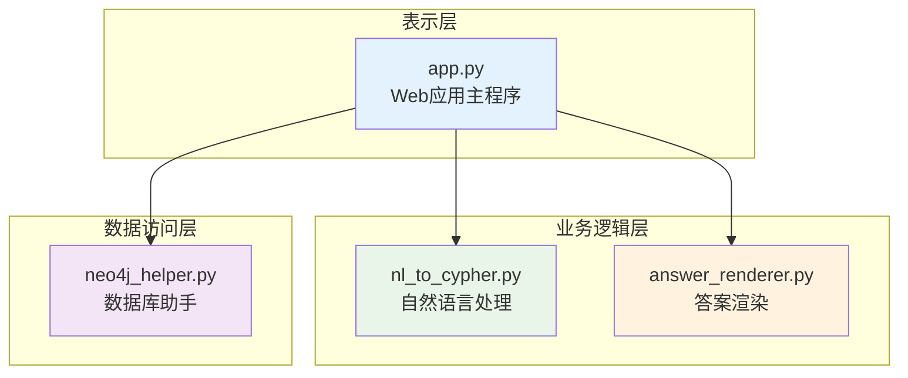
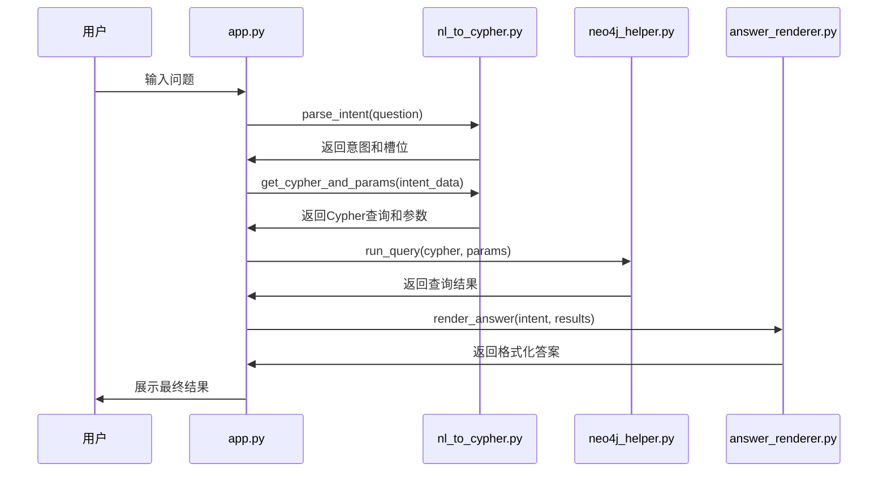

# 模块介绍

## 系统架构

ACM-ICPC知识图谱项目采用分层架构设计，各模块职责清晰，便于维护和扩展。



## 核心模块详解

### 📱 app.py - Web应用主程序

**职责**: 用户界面和应用流程控制
**技术**: Streamlit框架

#### 主要功能
- **界面构建**: 创建用户交互界面
- **流程控制**: 协调各模块间的调用
- **状态管理**: 管理应用会话状态
- **错误处理**: 统一的异常处理和用户提示

#### 关键组件
```python
# 页面配置
st.set_page_config(page_title="ACM KG 问答", layout="wide")

# 数据库连接初始化
def init_neo4j_connection():
    if 'neo4j_helper' not in st.session_state:
        st.session_state.neo4j_helper = Neo4jHelper(...)
```

#### 核心流程
1. **用户输入处理**: 接收并验证用户查询
2. **意图解析调用**: 调用`nl_to_cypher`模块
3. **数据库查询**: 使用`neo4j_helper`执行查询
4. **结果渲染**: 通过`answer_renderer`格式化输出

### 🧠 nl_to_cypher.py - 自然语言处理

**职责**: 意图识别和查询生成
**技术**: 正则表达式模式匹配

#### 核心数据结构

##### INTENT_PATTERNS - 意图模式定义
```python
INTENT_PATTERNS = [
    ("get_problem_difficulty", 
     r"(?:题目|问题|problem)\s*[\"']?([^\"']+)[\"']?\s*(?:的)?\s*(?:难度|rating)", 
     ["problem"]),
    # ... 更多模式
]
```

**结构说明**:
- **意图名称**: 查询类型标识符
- **正则表达式**: 匹配用户输入的模式
- **槽位名称**: 提取的参数名称列表

##### CYPHER_TEMPLATES - 查询模板
```python
CYPHER_TEMPLATES = {
    "get_problem_difficulty":
        "MATCH (p:Problem) WHERE toLower(p.name) CONTAINS toLower($problem) "
        "RETURN p.name AS name, p.rating AS rating LIMIT 10",
    # ... 更多模板
}
```

#### 核心函数

##### parse_intent() - 意图解析
```python
def parse_intent(question: str) -> Dict:
    """
    解析用户输入的自然语言问题
    
    Args:
        question: 用户输入的中文问题
        
    Returns:
        {
            "intent": "意图类型",
            "slots": {"参数名": "参数值"}
        }
    """
```

**处理流程**:
1. 遍历预定义的意图模式
2. 使用正则表达式匹配用户输入
3. 提取匹配的参数到槽位
4. 返回结构化的意图信息

##### get_cypher_and_params() - 查询生成
```python
def get_cypher_and_params(intent_data: Dict) -> Tuple[str, Dict]:
    """
    根据意图信息生成Cypher查询
    
    Args:
        intent_data: 意图解析结果
        
    Returns:
        (cypher_query, parameters)
    """
```

### 🗄️ neo4j_helper.py - 数据库助手

**职责**: 图数据库连接和查询执行
**技术**: Neo4j Python驱动

#### Neo4jHelper 类设计

##### 初始化和连接管理
```python
class Neo4jHelper:
    def __init__(self, uri="bolt://localhost:7687", user="neo4j", pwd="luogu20201208"):
        """
        初始化Neo4j连接器
        - 建立数据库连接
        - 测试连接有效性
        - 配置连接参数
        """
```

**特性**:
- **环境变量支持**: 通过环境变量配置连接参数
- **连接测试**: 初始化时验证连接有效性
- **异常处理**: 完善的连接异常处理机制

##### 查询执行
```python
def run_query(self, cypher: str, params: Dict = None) -> List[Dict[str, Any]]:
    """
    执行Cypher查询
    - 参数化查询防注入
    - 会话管理
    - 结果格式转换
    """
```

**安全特性**:
- **参数化查询**: 防止Cypher注入攻击
- **会话控制**: 自动管理数据库会话
- **资源释放**: 确保连接资源正确释放

##### 上下文管理
```python
def __enter__(self):
    return self

def __exit__(self, exc_type, exc_val, exc_tb):
    self.close()
```

### 🎨 answer_renderer.py - 答案渲染

**职责**: 将查询结果转换为用户友好的自然语言答案
**技术**: 基于意图的模板渲染

#### 渲染策略

##### render_answer() - 主渲染函数
```python
def render_answer(intent: str, rows: List[Dict]) -> str:
    """
    根据意图类型渲染查询结果
    
    Args:
        intent: 查询意图类型
        rows: 数据库查询结果
        
    Returns:
        格式化的自然语言答案
    """
```

#### 渲染规则

##### 题目信息渲染
```python
if intent == "get_problem_difficulty":
    lines = [f"题目：{r.get('name','')} — 难度：{r.get('rating','未知')}" 
             for r in rows]
    return "\n".join(lines)
```

##### 列表信息渲染
```python
if intent == "list_problems_by_tag":
    lines = [f"- {r.get('name')}（难度：{r.get('rating','未知')}）" 
             for r in rows]
    return "匹配题目：\n" + "\n".join(lines)
```

## 模块交互流程

### 查询处理完整流程


## 扩展点设计

### 新增查询类型
1. **意图模式扩展**: 在`INTENT_PATTERNS`中添加新规则
2. **查询模板定义**: 在`CYPHER_TEMPLATES`中定义Cypher模板
3. **渲染逻辑实现**: 在`render_answer`中添加新的渲染逻辑

### 模块增强方向
- **缓存机制**: 在数据库助手中添加查询缓存
- **异步处理**: 支持异步查询执行
- **监控告警**: 添加性能监控和异常告警
- **插件系统**: 支持动态加载新的处理模块