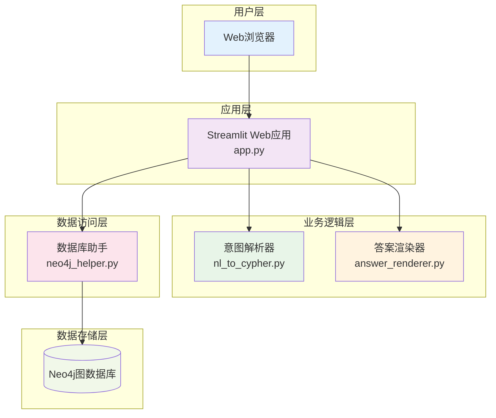

# ACM-ICPC知识图谱项目概述

## 项目简介

ACM-ICPC知识图谱项目是一个基于Neo4j图数据库和Streamlit前端框架的智能问答系统，专门用于ACM-ICPC竞赛相关知识的检索和查询。该系统通过自然语言处理技术，将用户的中文问题转换为图数据库查询，并返回格式化的答案。

## 项目目标

- **智能检索**: 提供基于自然语言的ACM竞赛知识检索能力
- **知识图谱**: 构建结构化的竞赛题目、选手、比赛等知识关系网络
- **用户友好**: 提供简洁易用的Web界面，支持中文问答
- **可扩展性**: 设计灵活的架构，便于添加新的查询类型和功能

## 核心特性

### 🔍 智能问答
- 支持中文自然语言问题输入
- 自动意图识别和参数提取
- 多种查询类型覆盖竞赛各个方面

### 📊 图数据库存储
- 使用Neo4j存储复杂的知识关系
- 高效的图遍历和关系查询
- 支持复杂的多跳关系查询

### 🌐 Web界面
- 基于Streamlit的现代化Web界面
- 实时查询结果展示
- 调试信息和执行过程可视化

### 🔧 可扩展架构
- 模块化设计，职责分离清晰
- 易于添加新的意图类型和查询模板
- 支持自定义渲染逻辑

## 应用场景

### 📚 学习辅助
- **题目查询**: 根据题目名称查询难度、标签等信息
- **算法学习**: 按算法类型查找相关练习题目
- **标签分类**: 通过标签快速定位特定类型题目

### 🏆 竞赛分析
- **选手信息**: 查询著名选手的参赛历史和成绩
- **比赛数据**: 获取历届比赛的冠军和排名信息
- **题解检索**: 查找特定作者的题解内容

### 👨‍💻 开发学习
- **项目架构**: 学习图数据库在知识管理中的应用
- **自然语言处理**: 了解基于正则表达式的意图识别方法
- **Web开发**: 掌握Streamlit快速构建数据应用的技巧

## 系统架构概览

## 技术亮点

### 🚀 现代技术栈
- **Python 3.9**: 稳定的运行环境和丰富的生态
- **Neo4j 5.9.0**: 业界领先的图数据库技术
- **Streamlit 1.30.0**: 快速构建数据应用的Python框架

### 🎯 智能意图识别
- 基于正则表达式的高效模式匹配
- 支持槽位提取和参数绑定
- 可配置的意图模式，易于扩展

### 🔧 灵活的查询引擎
- 参数化Cypher查询模板
- 防止SQL注入的安全设计
- 支持复杂的图遍历查询

### 📱 优秀的用户体验
- 响应式Web界面设计
- 实时查询进度反馈
- 详细的调试信息展示

## 项目价值

### 📖 教育价值
- **实践案例**: 提供图数据库应用的完整实现案例
- **架构学习**: 展示现代Web应用的分层架构设计
- **技术整合**: 演示多种技术栈的有效整合方式

### 🔬 研究价值
- **知识图谱**: 探索结构化知识表示和查询方法
- **自然语言处理**: 研究中文意图识别的实现策略
- **信息检索**: 实践基于图的知识检索技术

### 💼 商业价值
- **原型开发**: 可作为智能问答系统的原型参考
- **技术验证**: 验证图数据库在特定领域的应用效果
- **产品基础**: 为类似产品提供技术架构基础

## 快速体验

想要快速体验系统功能，可以尝试以下示例问题：

- "题目'两数之和'的难度"
- "有哪些关于动态规划的题目"
- "谁是2020年冠军"
- "作者张三的题解"
- "使用Dijkstra算法的题目"

## 文档导航

- [技术栈与依赖](./技术栈与依赖.md) - 了解项目使用的技术和依赖
- [核心功能说明](./核心功能说明.md) - 详细了解系统功能
- [模块介绍](./模块介绍.md) - 深入了解各个模块的实现
- [快速开始指南](./快速开始指南.md) - 快速搭建和运行项目
- [查询示例](./查询示例.md) - 学习如何使用系统进行查询
- [扩展开发指南](./扩展开发指南.md) - 了解如何扩展系统功能

---

*本项目基于设计文档实现，旨在提供一个完整、可用的ACM-ICPC知识图谱问答系统。*